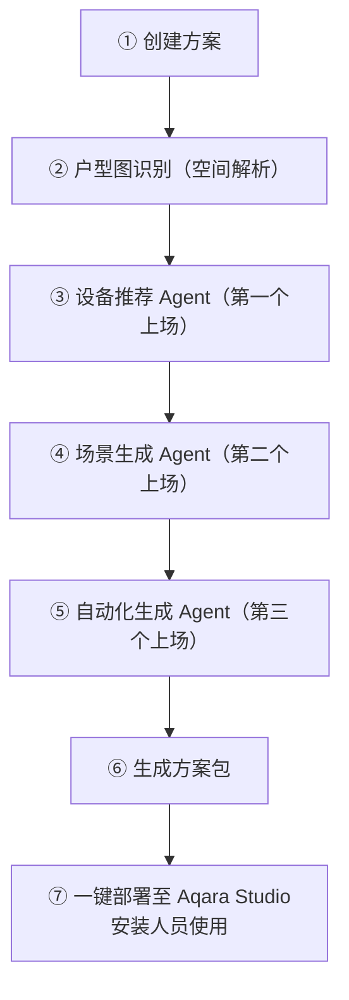

# 从需求到方案：完整玩法

## 完整路径

一次端到端的空间智能方案设计，通常走以下步骤：

**每一步在做什么：**

1. **创建方案**：在 Builder Lab 新建项目，命名，上传户型图
2. **户型图识别**：Agent 完成空间解析，把户型转成语义模型
3. **设备推荐 Agent**：根据需求生成设备清单（空房推荐 + 缺口补全）
4. **场景生成 Agent**：编排一键执行的智能场景（简单 / 复杂 Flow）
5. **自动化生成 Agent**：生成条件触发的自动化规则
6. **生成方案包**：三个 Agent 协作输出完整方案文件
7. **一键部署**：方案推送至 Aqara Studio，安装人员直接使用

## 快速上手

1. 在 Builder Lab 创建新方案，上传户型图
2. 户型图识别完成后，点击「激活 Agent」（设备推荐 Agent 第一个上场）
3. 输入你的空间需求（如「三室两厅，需要全屋灯光控制和空调智能」）
4. Agent 读取户型、理解空间，输出设备推荐清单
5. 根据需要，切换到场景生成或自动化生成，继续编排
6. 方案包生成后，一键推送至 Aqara Studio 安装使用

:::tip
如有疑问或需要补充说明，欢迎联系 Builder Agent 产品团队。
:::