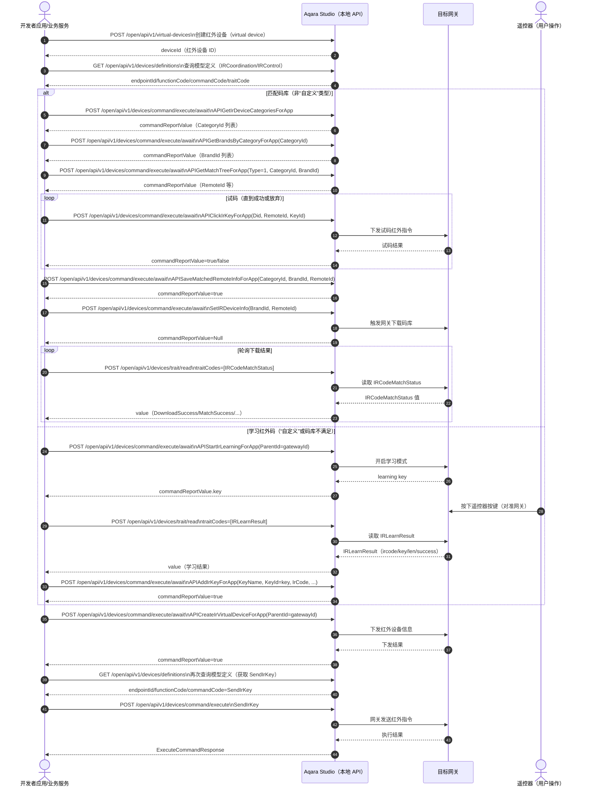

# 红外设备接入

本文描述如何通过 Studio 本地 API 将红外设备接入 Aqara Studio，从而通过网关下发红外指令控制红外设备。

## 时序图



## 流程

### 1 创建红外设备

通过 Studio 本地 API [`POST` /open/api/v1/virtual-devices](./../../data-export-api/add-virtual-device.api.mdx) 接口，创建一个红外设备，获取该红外设备 ID。

### 2 查询设备模型定义

通过 Studio 本地 API [`GET` /open/api/v1/devices/definitions](./../../data-export-api/get-device-definitions.api.mdx) 接口，传入红外设备 ID 及目标网关 ID，查询设备模型定义，以便获取后续操作所需的 **endpointId**、**functionCode** **commandCode**。

常用 commandCode 说明如下： 

| 类别       | 功能            | commandCode 或 traitCode                  |
|------------|-----------------|-----------------------------|
| 红外设备   | 获取设备类型     | `APIGetIrDeviceCategoriesForApp`    |
| 红外设备   | 获取品牌         | `APIGetBrandsByCategoryForApp`      |
| 红外设备   | 获取匹配树       | `APIGetMatchTreeForApp`             |
| 红外设备   | 试码             | `APIClickIrKeyForApp`               |
| 红外设备   | 保存匹配         | `APISaveMatchedRemoteInfoForApp`    |
| 红外设备   | 向网关下发红外设备信息         | `APICreateIrVirtualDeviceForApp`    |
| 红外设备 | 开启学习         | `APIStartIrLearningForApp` |
| 红外设备 | 保存学习按键     | `APIAddIrKeyForApp` |
| 红外设备       | 日常控制         | `SendIrKey` <br />**注意**：此 Command 仅在匹配完成后出现，因此，您需要在匹配完成后再次查询设备模型定义，才能获取到该 Command。                         |
| 网关       | 下载码库         | `SetIRDeviceInfo`                   |
| 网关       | 查询下载结果     | `IRCodeMatchStatus`                 |
| 网关       | 读取学习结果     | `IRLearnResult`                     |

以下为一个红外设备的设备详情示例：
```json {15,20,24,30,46,110,140,183}
{
  "type": "GetDevicesResponse",
  "version": "v1",
  "msgId": "2",
  "data": [
    {
      "deviceId": "virtual.1782388251128",
      "name": "Test1",
      "gatewayId": "",
      "deviceTypesList": [
        "IRDevice"
      ],
      "endpoints": [
        {
          "endpointId": 2,
          "endpointName": "IRCoordination",
          "deviceType": "IRDevice",
          "functions": [
            {
              "functionCode": "IRCoordination",
              "traits": [],
              "commands": [
                {
                  "commandCode": "APIGetIrDeviceCategoriesForApp",
                  "fields": [],
                  "description": "获取红外设备类型列表",
                  "pointName": "IR Remote Control Coordination - Get a list of infrared device types"
                },
                {
                  "commandCode": "APIGetBrandsByCategoryForApp",
                  "fields": [
                    {
                      "fieldCode": "CategoryId",
                      "parameter": {
                        "type": "Integer",
                        "mandatory": true,
                        "min": 1,
                        "max": 13
                      }
                    }
                  ],
                  "description": "根据设备类型获取品牌列表",
                  "pointName": "IR Remote Control Coordination - Get a list of brands based on device type"
                },
                {
                  "commandCode": "APIGetMatchTreeForApp",
                  "fields": [
                    {
                      "fieldCode": "Type",
                      "parameter": {
                        "type": "Enum",
                        "mandatory": true,
                        "supportedValues": [
                          {
                            "key": "CategoryTree",
                            "value": "1"
                          },
                          {
                            "key": "SpsCityTree",
                            "value": "2"
                          },
                          {
                            "key": "IptvTree",
                            "value": "3"
                          }
                        ]
                      }
                    },
                    {
                      "fieldCode": "CategoryId",
                      "parameter": {
                        "type": "Integer",
                        "mandatory": true,
                        "min": 1,
                        "max": 13
                      }
                    },
                    {
                      "fieldCode": "BrandId",
                      "parameter": {
                        "type": "Integer",
                        "mandatory": true,
                        "min": 0,
                        "max": 99999
                      }
                    },
                    {
                      "fieldCode": "CityId",
                      "parameter": {
                        "type": "Integer",
                        "mandatory": false,
                        "min": 0,
                        "max": 999999
                      }
                    },
                    {
                      "fieldCode": "SpId",
                      "parameter": {
                        "type": "Integer",
                        "mandatory": false,
                        "min": 0,
                        "max": 99999
                      }
                    }
                  ],
                  "description": "获取匹配树",
                  "pointName": "IR Remote Control Coordination - Get matching tree information"
                },
                {
                  "commandCode": "APIClickIrKeyForApp",
                  "fields": [
                    {
                      "fieldCode": "Did",
                      "parameter": {
                        "type": "String",
                        "mandatory": true
                      }
                    },
                    {
                      "fieldCode": "RemoteId",
                      "parameter": {
                        "type": "Integer",
                        "mandatory": true,
                        "min": 0,
                        "max": 999999
                      }
                    },
                    {
                      "fieldCode": "KeyId",
                      "parameter": {
                        "type": "String",
                        "mandatory": true
                      }
                    }
                  ],
                  "description": "key control",
                  "pointName": "IR Remote Control Coordination - Click the remote control button"
                },
                {
                  "commandCode": "APISaveMatchedRemoteInfoForApp",
                  "fields": [
                    {
                      "fieldCode": "CategoryId",
                      "parameter": {
                        "type": "Integer",
                        "mandatory": true,
                        "min": 1,
                        "max": 13
                      }
                    },
                    {
                      "fieldCode": "BrandId",
                      "parameter": {
                        "type": "Integer",
                        "mandatory": false,
                        "min": 0,
                        "max": 99999
                      }
                    },
                    {
                      "fieldCode": "RemoteId",
                      "parameter": {
                        "type": "Integer",
                        "mandatory": false,
                        "min": 0,
                        "max": 999999
                      }
                    },
                    {
                      "fieldCode": "SpId",
                      "parameter": {
                        "type": "Integer",
                        "mandatory": false,
                        "min": 0,
                        "max": 99999
                      }
                    }
                  ],
                  "description": "save virtual brand info",
                  "pointName": "IR Remote Control Coordination - Save Successfully Matched Remote Control Information"
                },
                {
                  "commandCode": "APICreateIrVirtualDeviceForApp",
                  "fields": [
                    {
                      "fieldCode": "ParentId",
                      "parameter": {
                        "type": "String",
                        "mandatory": true
                      }
                    }
                  ],
                  "description": "创建本地化的红外码虚拟设备",
                  "pointName": "IR Remote Control Coordination - Create a localized infrared code virtual device"
                },
                {
                  "commandCode": "APIAddIrKeyForApp",
                  "fields": [
                    {
                      "fieldCode": "KeyName",
                      "parameter": {
                        "type": "String",
                        "mandatory": true
                      }
                    },
                    {
                      "fieldCode": "KeyId",
                      "parameter": {
                        "type": "String",
                        "mandatory": true
                      }
                    },
                    {
                      "fieldCode": "IrCode",
                      "parameter": {
                        "type": "String",
                        "mandatory": true
                      }
                    },
                    {
                      "fieldCode": "Freq",
                      "parameter": {
                        "type": "String",
                        "mandatory": false
                      }
                    },
                    {
                      "fieldCode": "Len",
                      "parameter": {
                        "type": "Integer",
                        "mandatory": false,
                        "min": 0,
                        "max": 2000
                      }
                    }
                  ],
                  "description": "遥控器增加按键",
                  "pointName": "IR Remote Control Coordination - Add buttons to the remote control"
                },
                {
                  "commandCode": "APIStartIrLearningForApp",
                  "fields": [
                    {
                      "fieldCode": "ParentId",
                      "parameter": {
                        "type": "String",
                        "mandatory": true
                      }
                    }
                  ],
                  "description": "开启红外学习",
                  "pointName": "IR Remote Control Coordination - Start infrared code learning"
                }
              ]
            }
          ]
        }
      ]
    }
  ],
  "code": 0,
  "message": "success"
}
```

以下为一个网关的设备详情示例：
```json {19,24,253,137,172}
{
  "type": "GetDevicesResponse",
  "version": "v1",
  "msgId": "1",
  "data": [
    {
      "deviceId": "lumi3.a61fca0f4da1a0bd",
      "name": "Edge Hub M300",
      "gatewayId": "lumi3.a61fca0f4da1a0bd",
      "deviceTypesList": [
        "Hub",
        "SpaceSecurity",
        "AirConditioner",
        "IRDevice"
      ],
      "endpoints": [
        ...
        {
          "endpointId": 5,
          "endpointName": "IR Device",
          "deviceType": "IRDevice",
          "functions": [
            {
              "functionCode": "IRControl",
              "traits": [
                {
                  "traitCode": "IRKey",
                  "parameter": {
                    "type": "Enum",
                    "readable": false,
                    "writable": true,
                    "subscribable": false,
                    "supportedValues": [
                      {
                        "key": "Reserved",
                        "value": "0"
                      },
                      {
                        "key": "Power",
                        "value": "1"
                      },
                      {
                        "key": "Mode",
                        "value": "2"
                      },
                      {
                        "key": "Temp+",
                        "value": "3"
                      },
                      {
                        "key": "Temp-",
                        "value": "4"
                      },
                      {
                        "key": "WindSpeed",
                        "value": "5"
                      },
                      {
                        "key": "P_KEY",
                        "value": "9637"
                      }
                    ],
                    "unit": ""
                  },
                  "value": "0",
                  "time": 1782442722197,
                  "pointName": "Infrared Commands"
                },
                {
                  "traitCode": "IRType",
                  "parameter": {
                    "type": "Enum",
                    "readable": true,
                    "writable": true,
                    "subscribable": true,
                    "supportedValues": [
                      {
                        "key": "AirConditioner",
                        "value": "0"
                      },
                      {
                        "key": "TV",
                        "value": "1"
                      },
                      {
                        "key": "Fan",
                        "value": "2"
                      },
                      {
                        "key": "TVBox",
                        "value": "3"
                      },
                      {
                        "key": "Projector",
                        "value": "4"
                      },
                      {
                        "key": "SettopBox",
                        "value": "5"
                      },
                      {
                        "key": "DVD",
                        "value": "6"
                      },
                      {
                        "key": "Heater",
                        "value": "7"
                      },
                      {
                        "key": "AirPurifier",
                        "value": "8"
                      },
                      {
                        "key": "Speaker",
                        "value": "9"
                      },
                      {
                        "key": "Lighting",
                        "value": "10"
                      },
                      {
                        "key": "Camera",
                        "value": "11"
                      },
                      {
                        "key": "Customize",
                        "value": "12"
                      }
                    ],
                    "unit": ""
                  },
                  "value": "0",
                  "time": 1782442722204,
                  "pointName": "Infrared type"
                },
                {
                  "traitCode": "IRCodeMatchStatus",
                  "parameter": {
                    "type": "Enum",
                    "readable": true,
                    "writable": false,
                    "subscribable": true,
                    "supportedValues": [
                      {
                        "key": "Default",
                        "value": "0"
                      },
                      {
                        "key": "MatchSuccess",
                        "value": "1"
                      },
                      {
                        "key": "MatchFailure",
                        "value": "2"
                      },
                      {
                        "key": "Redownload",
                        "value": "3"
                      },
                      {
                        "key": "DownloadSuccess",
                        "value": "4"
                      }
                    ],
                    "unit": ""
                  },
                  "value": "4",
                  "time": 1782442722206,
                  "pointName": "Infrared Code Match Status"
                },
                {
                  "traitCode": "IRLearnResult",
                  "parameter": {
                    "type": "Struct",
                    "readable": true,
                    "writable": false,
                    "subscribable": true,
                    "unit": ""
                  },
                  "value": "",
                  "time": 1782442722214,
                  "pointName": "IR Learning Result"
                }
              ],
              "commands": [
                {
                  "commandCode": "SendIRCode",
                  "fields": [
                    {
                      "fieldCode": "Mode",
                      "parameter": {
                        "type": "Enum",
                        "mandatory": true,
                        "supportedValues": [
                          {
                            "key": "mode0",
                            "value": "0"
                          },
                          {
                            "key": "mode1",
                            "value": "1"
                          }
                        ]
                      }
                    },
                    {
                      "fieldCode": "BrandId",
                      "parameter": {
                        "type": "Integer",
                        "mandatory": true
                      }
                    },
                    {
                      "fieldCode": "RemoteId",
                      "parameter": {
                        "type": "Integer",
                        "mandatory": true
                      }
                    },
                    {
                      "fieldCode": "IRCode",
                      "parameter": {
                        "type": "String",
                        "mandatory": false
                      }
                    },
                    {
                      "fieldCode": "IRCodeLength",
                      "parameter": {
                        "type": "Integer",
                        "mandatory": false
                      }
                    },
                    {
                      "fieldCode": "ACKey",
                      "parameter": {
                        "type": "String",
                        "mandatory": false
                      }
                    },
                    {
                      "fieldCode": "Frequency",
                      "parameter": {
                        "type": "Integer",
                        "mandatory": true
                      }
                    }
                  ],
                  "description": "发送红外指令",
                  "pointName": "Send infrared commands"
                },
                {
                  "commandCode": "SetIRDeviceInfo",
                  "fields": [
                    {
                      "fieldCode": "BrandId",
                      "parameter": {
                        "type": "Integer",
                        "mandatory": true,
                        "min": 0,
                        "max": 4294967295,
                        "step": 1
                      }
                    },
                    {
                      "fieldCode": "RemoteId",
                      "parameter": {
                        "type": "Integer",
                        "mandatory": true,
                        "min": 0,
                        "max": 4294967295
                      }
                    },
                    {
                      "fieldCode": "ACMode",
                      "parameter": {
                        "type": "Integer",
                        "mandatory": false,
                        "min": 0,
                        "max": 4294967295,
                        "step": 1
                      }
                    },
                    {
                      "fieldCode": "ACType",
                      "parameter": {
                        "type": "Integer",
                        "mandatory": false,
                        "min": 0,
                        "max": 4294967295,
                        "step": 1
                      }
                    }
                  ],
                  "description": "配置红外设备信息",
                  "pointName": "Configure infrared device information"
                }
              ]
            }
          ]
        }
      ]
    }
  ],
  "code": 0,
  "message": "success"
}
```

### 3 匹配红外码库


#### 3.1 获取设备类型

首先，需要为新建的红外设备指定设备类型（如空调、风扇等），以匹配您的实际红外设备类型。

调用 Studio 本地 API [`POST` /open/api/v1/devices/command/execute/await](./../../data-export-api/execute-device-command-await.api.mdx) 接口，使用 `commandCode` 为 `APIGetIrDeviceCategoriesForApp`，并在 `data.args` 数组内设置为`[]`，以获取当前 Aqara Studio 支持的红外设备类型列表。

以下为请求 Body（JSON）示例：

```json
{
  "data": [
    {
      "deviceId": "virtual.1782462773707",
      "endpointId": 2,
      "functionCode": "IRCoordination",
      "commandCode": "APIGetIrDeviceCategoriesForApp",
      "args": []
    }
  ],
  "timeoutMs": 0
}
```

以下为接口响应 Body（JSON）示例：

```json {14}
{
  "type": "ExecuteCommandAwaitResponse",
  "version": "v1",
  "msgId": "16",
  "data": [
    {
      "deviceId": "virtual.1782462773707",
      "endpointId": 2,
      "functionCode": "IRCoordination",
      "commandCode": "APIGetIrDeviceCategoriesForApp",
      "code": 0,
      "message": "success",
      "responded": true,
      "commandReportValue": "[{\"id\":2,\"code\":\"TV\",\"name\":\"电视\",\"model\":\"virtual.models.tv\"},{\"id\":3,\"code\":\"BOX\",\"name\":\"盒子\",\"model\":\"virtual.models.box\"},{\"id\":4,\"code\":\"DVD\",\"name\":\"DVD\",\"model\":\"virtual.models.dvd\"},{\"id\":5,\"code\":\"AC\",\"name\":\"空调\",\"model\":\"virtual.models.ac\"},{\"id\":6,\"code\":\"Pro\",\"name\":\"投影仪\",\"model\":\"virtual.models.pro\"},{\"id\":7,\"code\":\"PA\",\"name\":\"音响\",\"model\":\"virtual.models.pa\"},{\"id\":8,\"code\":\"FAN\",\"name\":\"风扇\",\"model\":\"virtual.models.fan\"},{\"id\":9,\"code\":\"SLR\",\"name\":\"照相机\",\"model\":\"virtual.models.slr\"},{\"id\":10,\"code\":\"Light\",\"name\":\"智能灯\",\"model\":\"virtual.models.light\"},{\"id\":11,\"code\":\"AirCleaner\",\"name\":\"空气净化器\",\"model\":\"virtual.models.aircleaner\"},{\"id\":12,\"code\":\"WaterHeater\",\"name\":\"热水器\",\"model\":\"virtual.models.waterheater\"},{\"id\":13,\"code\":\"default\",\"name\":\"自定义\",\"model\":\"virtual.models.default\"}]",
      "responseTime": 1782464191572
    }
  ],
  "code": 0
}
```

你需要将 `data.commandReportValue` 字段反序列化为数组后，便可获取支持的红外设备类型（字段包括 id、code、name、model）。请根据实际需求选择合适的类型，

如下为反序列化后获得的数组示例：

```json
[
  {"id":2,"code":"TV","name":"电视","model":"virtual.models.tv"},
  {"id":3,"code":"BOX","name":"盒子","model":"virtual.models.box"},
  {"id":4,"code":"DVD","name":"DVD","model":"virtual.models.dvd"},
  {"id":5,"code":"AC","name":"空调","model":"virtual.models.ac"},
  {"id":6,"code":"Pro","name":"投影仪","model":"virtual.models.pro"},
  {"id":7,"code":"PA","name":"音响","model":"virtual.models.pa"},
  {"id":8,"code":"FAN","name":"风扇","model":"virtual.models.fan"},
  {"id":9,"code":"SLR","name":"照相机","model":"virtual.models.slr"},
  {"id":10,"code":"Light","name":"智能灯","model":"virtual.models.light"},
  {"id":11,"code":"AirCleaner","name":"空气净化器","model":"virtual.models.aircleaner"},
  {"id":12,"code":"WaterHeater","name":"热水器","model":"virtual.models.waterheater"},
  {"id":13,"code":"default","name":"自定义","model":"virtual.models.default"}
]
```

从中选择合适的类型并记录相关字段用于后续流程。

如果您选择**自定义**类型，请直接跳转至 [学习红外码](#4-学习红外码) 章节。

#### 3.2 获取品牌

在确定红外设备类型后，下一步需获取该类型对应的品牌列表（如格力、美的等），用于后续红外码的匹配流程。

请通过 Studio 本地 API [`POST` /open/api/v1/devices/command/execute/await](./../../data-export-api/execute-device-command-await.api.mdx) 接口，并设置 `commandCode` 为 `APIGetBrandsByCategoryForApp`，并在 `data.args` 数组内设置以下参数：

| 参数         | 类型     | 是否必填 | 说明                                                                         |
| ------------ | -------- | -------- | ---------------------------------------------------------------------------- |
| CategoryId   | integer  | ✔       | 填入上述 [获取设备类型](#31-获取设备类型) 接口返回的 `commandReportValue.id`。               |

以下为请求 Body（JSON）示例：
```json
// 获取风扇品牌列表
{
  "data": [
    {
      "deviceId": "virtual.1782462773707",
      "endpointId": 2,
      "functionCode": "IRCoordination",
      "commandCode": "APIGetBrandsByCategoryForApp",
      "args": [
        {
          "fieldCode": "CategoryId",
          "value": 8
        }
      ]
    }
  ],
  "timeoutMs": 0
}
```

以下为接口响应 Body（JSON）示例：
```json {14}
{
  "type": "ExecuteCommandAwaitResponse",
  "version": "v1",
  "msgId": "17",
  "data": [
    {
      "deviceId": "virtual.1782462773707",
      "endpointId": 2,
      "functionCode": "IRCoordination",
      "commandCode": "APIGetBrandsByCategoryForApp",
      "code": 0,
      "message": "success",
      "responded": true,
      "commandReportValue": "[{\"pinyin\":\"tianmin\",\"brandId\":1077,\"name\":\"天敏\",\"enName\":\"10moons\"},{\"pinyin\":\"m\",\"brandId\":1867,\"name\":\"3M\",\"enName\":\"3M\"},{\"pinyin\":\"shimisi\",\"brandId\":208,\"name\":\"史密斯\",\"enName\":\"A.O.Smith\"},{\"pinyin\":\"aaf\",\"brandId\":224,\"name\":\"AAF\",\"enName\":\"AAF\"},{\"pinyin\":\"aimeite\",\"brandId\":2602,\"name\":\"艾美特\",\"enName\":\"Airmate\"},{\"pinyin\":\"alpha\",\"brandId\":225,\"name\":\"Alpha\",\"enName\":\"Alpha\"},{\"pinyin\":\"yamosi\",\"brandId\":2637,\"name\":\"亚摩斯\",\"enName\":\"Amos\"},{\"pinyin\":\"aolisi\",\"brandId\":153,\"name\":\"奥丽思\",\"enName\":\"Aonice\"},{\"pinyin\":\"atomberg\",\"brandId\":2354,\"name\":\"Atomberg\",\"enName\":\"Atomberg\"},{\"pinyin\":\"aokema\",\"brandId\":102,\"name\":\"澳柯玛\",\"enName\":\"Aucma\"},{\"pinyin\":\"aokesi\",\"brandId\":192,\"name\":\"奥克斯\",\"enName\":\"Aux\"},{\"pinyin\":\"aiweiyaer\",\"brandId\":2541,\"name\":\"艾威亚迩\",\"enName\":\"AVIAIR\"},{\"pinyin\":\"baihua\",\"brandId\":397,\"name\":\"百花\",\"enName\":\"Baihua\"},{\"pinyin\":\"baili\",\"brandId\":2822,\"name\":\"百立\",\"enName\":\"Baili\"},{\"pinyin\":\"bailang\",\"brandId\":186,\"name\":\"白朗\",\"enName\":\"Bairan\"},{\"pinyin\":\"beili\",\"brandId\":185,\"name\":\"贝丽\",\"enName\":\"Beili\"},{\"pinyin\":\"bianfu\",\"brandId\":223,\"name\":\"蝙蝠\",\"enName\":\"Bianfu\"},{\"pinyin\":\"luotuo\",\"brandId\":2642,\"name\":\"骆驼\",\"enName\":\"Camel\"},{\"pinyin\":\"changhong\",\"brandId\":17,\"name\":\"长虹\",\"enName\":\"Changhong\"},{\"pinyin\":\"zhigao\",\"brandId\":197,\"name\":\"志高\",\"enName\":\"Chigo\"},{\"pinyin\":\"jimei\",\"brandId\":832,\"name\":\"奇美\",\"enName\":\"CHIMEI\"},{\"pinyin\":\"zuanshi\",\"brandId\":2667,\"name\":\"钻石\",\"enName\":\"Diamond\"},{\"pinyin\":\"dier\",\"brandId\":188,\"name\":\"谛尔\",\"enName\":\"Dier\"},{\"pinyin\":\"duoli\",\"brandId\":2672,\"name\":\"多丽\",\"enName\":\"Duoli\"},{\"pinyin\":\"daisen\",\"brandId\":4959,\"name\":\"戴森\",\"enName\":\"Dyson\"},{\"pinyin\":\"yilaikesi\",\"brandId\":137,\"name\":\"伊莱克斯\",\"enName\":\"Electrolux\"},{\"pinyin\":\"yongsheng\",\"brandId\":2677,\"name\":\"永生\",\"enName\":\"Eosn\"},{\"pinyin\":\"europace\",\"brandId\":221,\"name\":\"EuropAce\",\"enName\":\"EuropAce\"},{\"pinyin\":\"feidie\",\"brandId\":220,\"name\":\"飞碟\",\"enName\":\"Feidie\"},{\"pinyin\":\"xinfei\",\"brandId\":1437,\"name\":\"新飞\",\"enName\":\"Frestec\"},{\"pinyin\":\"fushibao\",\"brandId\":2622,\"name\":\"富士宝\",\"enName\":\"Fushibao\"},{\"pinyin\":\"changcheng\",\"brandId\":357,\"name\":\"长城\",\"enName\":\"Great Wall\"},{\"pinyin\":\"geli\",\"brandId\":97,\"name\":\"格力\",\"enName\":\"Gree\"},{\"pinyin\":\"haier\",\"brandId\":37,\"name\":\"海尔\",\"enName\":\"Haier\"},{\"pinyin\":\"huikang\",\"brandId\":1522,\"name\":\"惠康\",\"enName\":\"Hicon\"},{\"pinyin\":\"huoniweier\",\"brandId\":3451,\"name\":\"霍尼韦尔\",\"enName\":\"Honeywell\"},{\"pinyin\":\"huipu\",\"brandId\":1902,\"name\":\"惠普\",\"enName\":\"HP\"},{\"pinyin\":\"huabao\",\"brandId\":592,\"name\":\"华宝\",\"enName\":\"Huabao\"},{\"pinyin\":\"huicheng\",\"brandId\":2717,\"name\":\"汇成\",\"enName\":\"Huicheng\"},{\"pinyin\":\"xiandai\",\"brandId\":922,\"name\":\"现代\",\"enName\":\"Hyundai\"},{\"pinyin\":\"riben\",\"brandId\":195,\"name\":\"日本\",\"enName\":\"Japan\"},{\"pinyin\":\"jiling\",\"brandId\":16,\"name\":\"机灵\",\"enName\":\"Jiling\"},{\"pinyin\":\"jinling\",\"brandId\":216,\"name\":\"金羚\",\"enName\":\"Jinling\"},{\"pinyin\":\"jinlong\",\"brandId\":215,\"name\":\"金龙\",\"enName\":\"Jinlong\"},{\"pinyin\":\"jinshikang\",\"brandId\":189,\"name\":\"金世康\",\"enName\":\"jinshikang\"},{\"pinyin\":\"jinsong\",\"brandId\":1172,\"name\":\"金松\",\"enName\":\"Jinsong\"},{\"pinyin\":\"jiuhehongsheng\",\"brandId\":190,\"name\":\"九和宏盛\",\"enName\":\"Juhehongsheng\"},{\"pinyin\":\"juhua\",\"brandId\":752,\"name\":\"菊花\",\"enName\":\"JUHUA\"},{\"pinyin\":\"jiebao\",\"brandId\":218,\"name\":\"捷宝\",\"enName\":\"Jyeproud\"},{\"pinyin\":\"kadiya\",\"brandId\":214,\"name\":\"卡帝亚\",\"enName\":\"Kadder\"},{\"pinyin\":\"kdk\",\"brandId\":2827,\"name\":\"KDK\",\"enName\":\"KDK\"},{\"pinyin\":\"kelong\",\"brandId\":577,\"name\":\"科龙\",\"enName\":\"Kelon\"},{\"pinyin\":\"gelin\",\"brandId\":657,\"name\":\"歌林\",\"enName\":\"Kolin\"},{\"pinyin\":\"kangjia\",\"brandId\":42,\"name\":\"康佳\",\"enName\":\"Konka\"},{\"pinyin\":\"lasike\",\"brandId\":191,\"name\":\"拉斯科\",\"enName\":\"Lasko\"},{\"pinyin\":\"lianchuang\",\"brandId\":2607,\"name\":\"联创\",\"enName\":\"Lianchuang\"},{\"pinyin\":\"lijing\",\"brandId\":184,\"name\":\"丽精\",\"enName\":\"Lijing\"},{\"pinyin\":\"xiaoya\",\"brandId\":1422,\"name\":\"小鸭\",\"enName\":\"Littleduck\"},{\"pinyin\":\"xiaotiane\",\"brandId\":2657,\"name\":\"小天鹅\",\"enName\":\"Littleswan\"},{\"pinyin\":\"long昇\",\"brandId\":2652,\"name\":\"龙昇\",\"enName\":\"Longsheng\"},{\"pinyin\":\"mali\",\"brandId\":213,\"name\":\"马丽\",\"enName\":\"Mali\"},{\"pinyin\":\"meidisi\",\"brandId\":193,\"name\":\"美蒂思\",\"enName\":\"Medis\"},{\"pinyin\":\"meiling\",\"brandId\":1262,\"name\":\"美菱\",\"enName\":\"Meiling\"},{\"pinyin\":\"meidi\",\"brandId\":182,\"name\":\"美的\",\"enName\":\"Midea\"},{\"pinyin\":\"milux\",\"brandId\":194,\"name\":\"MILUX\",\"enName\":\"MILUX\"},{\"pinyin\":\"sanling\",\"brandId\":107,\"name\":\"三菱\",\"enName\":\"Mitsubishi\"},{\"pinyin\":\"shuixian\",\"brandId\":2513,\"name\":\"水仙\",\"enName\":\"Narcissus\"},{\"pinyin\":\"lesheng\",\"brandId\":3238,\"name\":\"乐声\",\"enName\":\"National\"},{\"pinyin\":\"riguang\",\"brandId\":1562,\"name\":\"日光\",\"enName\":\"Nikko\"},{\"pinyin\":\"aodeer\",\"brandId\":2682,\"name\":\"奥德尔\",\"enName\":\"Odor\"},{\"pinyin\":\"origo\",\"brandId\":5029,\"name\":\"Origo\",\"enName\":\"Origo\"},{\"pinyin\":\"songxia\",\"brandId\":202,\"name\":\"松下\",\"enName\":\"Panasonic\"},{\"pinyin\":\"feilipu\",\"brandId\":52,\"name\":\"飞利浦\",\"enName\":\"Philips\"},{\"pinyin\":\"pinnuo\",\"brandId\":211,\"name\":\"品诺\",\"enName\":\"Pinoh\"},{\"pinyin\":\"xianfeng\",\"brandId\":62,\"name\":\"先锋\",\"enName\":\"Pioneer\"},{\"pinyin\":\"qihua\",\"brandId\":210,\"name\":\"启华\",\"enName\":\"Qihua\"},{\"pinyin\":\"ricai\",\"brandId\":1337,\"name\":\"日彩\",\"enName\":\"Ricai\"},{\"pinyin\":\"huageli\",\"brandId\":219,\"name\":\"华格立\",\"enName\":\"Richland\"},{\"pinyin\":\"rongsheng\",\"brandId\":2687,\"name\":\"容声\",\"enName\":\"Rongsheng\"},{\"pinyin\":\"rongshida\",\"brandId\":2617,\"name\":\"荣事达\",\"enName\":\"Royalsta\"},{\"pinyin\":\"yinghua\",\"brandId\":204,\"name\":\"樱花\",\"enName\":\"Sakura\"},{\"pinyin\":\"shengbao\",\"brandId\":3050,\"name\":\"声宝\",\"enName\":\"Sampo\"},{\"pinyin\":\"sangpu\",\"brandId\":2692,\"name\":\"桑普\",\"enName\":\"Sampux\"},{\"pinyin\":\"sanyang\",\"brandId\":232,\"name\":\"三洋\",\"enName\":\"Sanyo\"},{\"pinyin\":\"xianke\",\"brandId\":927,\"name\":\"先科\",\"enName\":\"SAST\"},{\"pinyin\":\"shanhu\",\"brandId\":196,\"name\":\"山湖\",\"enName\":\"Shanhu\"},{\"pinyin\":\"xiapu\",\"brandId\":57,\"name\":\"夏普\",\"enName\":\"Sharp\"},{\"pinyin\":\"shifeng\",\"brandId\":2697,\"name\":\"时丰\",\"enName\":\"Shifeng\"},{\"pinyin\":\"saiyi\",\"brandId\":2627,\"name\":\"赛亿\",\"enName\":\"Shinee\"},{\"pinyin\":\"siyu\",\"brandId\":2702,\"name\":\"丝雨\",\"enName\":\"Siyu\"},{\"pinyin\":\"skg\",\"brandId\":166,\"name\":\"SKG\",\"enName\":\"SKG\"},{\"pinyin\":\"shunfa\",\"brandId\":209,\"name\":\"顺发\",\"enName\":\"Sunfar\"},{\"pinyin\":\"datong\",\"brandId\":637,\"name\":\"大同\",\"enName\":\"Tatung\"},{\"pinyin\":\"tcl\",\"brandId\":27,\"name\":\"TCL\",\"enName\":\"TCL\"},{\"pinyin\":\"dongyuan\",\"brandId\":617,\"name\":\"东元\",\"enName\":\"TECO\"},{\"pinyin\":\"delufenggen\",\"brandId\":887,\"name\":\"德律风根\",\"enName\":\"Telefunken\"},{\"pinyin\":\"tairui\",\"brandId\":198,\"name\":\"泰瑞\",\"enName\":\"TERA\"},{\"pinyin\":\"tangmuxun\",\"brandId\":882,\"name\":\"汤姆逊\",\"enName\":\"Thomson\"},{\"pinyin\":\"tianma\",\"brandId\":199,\"name\":\"天马\",\"enName\":\"Tianma\"},{\"pinyin\":\"cankun\",\"brandId\":2647,\"name\":\"灿坤\",\"enName\":\"Tkec\"},{\"pinyin\":\"dongbao\",\"brandId\":532,\"name\":\"东宝\",\"enName\":\"Tobo\"},{\"pinyin\":\"dongzhi\",\"brandId\":22,\"name\":\"东芝\",\"enName\":\"Toshiba\"},{\"pinyin\":\"dasong\",\"brandId\":371,\"name\":\"大松\",\"enName\":\"Tosot\"},{\"pinyin\":\"toyomi\",\"brandId\":200,\"name\":\"Toyomi\",\"enName\":\"Toyomi\"},{\"pinyin\":\"huasheng\",\"brandId\":2612,\"name\":\"华生\",\"enName\":\"Wahson\"},{\"pinyin\":\"woerdun\",\"brandId\":3568,\"name\":\"沃尔顿\",\"enName\":\"Walton\"},{\"pinyin\":\"wanbao\",\"brandId\":1402,\"name\":\"万宝\",\"enName\":\"Wanbao\"},{\"pinyin\":\"wotesen\",\"brandId\":3304,\"name\":\"沃特森\",\"enName\":\"Watson\"},{\"pinyin\":\"weili\",\"brandId\":1667,\"name\":\"威力\",\"enName\":\"Weili\"},{\"pinyin\":\"weili\",\"brandId\":206,\"name\":\"威利\",\"enName\":\"Welly\"},{\"pinyin\":\"xiwu\",\"brandId\":1047,\"name\":\"西屋\",\"enName\":\"Westinghouse\"},{\"pinyin\":\"huierpu\",\"brandId\":227,\"name\":\"惠而浦\",\"enName\":\"Whirlpool\"},{\"pinyin\":\"xiaoxiang\",\"brandId\":201,\"name\":\"小象\",\"enName\":\"Xiaoxiang\"},{\"pinyin\":\"xiaoxingxing\",\"brandId\":2662,\"name\":\"小行星\",\"enName\":\"Xiaoxingxing\"},{\"pinyin\":\"xinde\",\"brandId\":2707,\"name\":\"新的\",\"enName\":\"Xinde\"},{\"pinyin\":\"xinhe\",\"brandId\":205,\"name\":\"欣禾\",\"enName\":\"Xinhe\"},{\"pinyin\":\"yadou\",\"brandId\":203,\"name\":\"亚都\",\"enName\":\"Yadu\"},{\"pinyin\":\"yangzi\",\"brandId\":212,\"name\":\"扬子\",\"enName\":\"Yair\"},{\"pinyin\":\"yangzi\",\"brandId\":2832,\"name\":\"杨子\",\"enName\":\"Yangzi\"},{\"pinyin\":\"yuandong\",\"brandId\":2837,\"name\":\"远东\",\"enName\":\"Yuandong\"},{\"pinyin\":\"zhonglian\",\"brandId\":2632,\"name\":\"中联\",\"enName\":\"Zolee\"}]",
      "responseTime": 1782466210727
    }
  ],
  "code": 0
}
```

你需要将 `data.commandReportValue` 字段反序列化为数组后，便可获取支持的设备品牌信息（字段包括 pinyin、brandId、name、enName）。请在品牌列表中查找您实际使用的红外设备品牌。

如下为反序列化后获得的数组示例：
```json
[
  { "pinyin": "tianmin", "brandId": 1077, "name": "天敏", "enName": "10moons" },
  { "pinyin": "m", "brandId": 1867, "name": "3M", "enName": "3M" },
  { "pinyin": "shimisi", "brandId": 208, "name": "史密斯", "enName": "A.O.Smith" },
  { "pinyin": "aaf", "brandId": 224, "name": "AAF", "enName": "AAF" },
  { "pinyin": "aimeite", "brandId": 2602, "name": "艾美特", "enName": "Airmate" },
  { "pinyin": "alpha", "brandId": 225, "name": "Alpha", "enName": "Alpha" },
  { "pinyin": "yamosi", "brandId": 2637, "name": "亚摩斯", "enName": "Amos" },
  { "pinyin": "aolisi", "brandId": 153, "name": "奥丽思", "enName": "Aonice" },
  { "pinyin": "atomberg", "brandId": 2354, "name": "Atomberg", "enName": "Atomberg" },
  { "pinyin": "aokema", "brandId": 102, "name": "澳柯玛", "enName": "Aucma" },
  { "pinyin": "aokesi", "brandId": 192, "name": "奥克斯", "enName": "Aux" },
  { "pinyin": "aiweiyaer", "brandId": 2541, "name": "艾威亚迩", "enName": "AVIAIR" },
  { "pinyin": "baihua", "brandId": 397, "name": "百花", "enName": "Baihua" },
  { "pinyin": "baili", "brandId": 2822, "name": "百立", "enName": "Baili" },
  { "pinyin": "bailang", "brandId": 186, "name": "白朗", "enName": "Bairan" },
  { "pinyin": "beili", "brandId": 185, "name": "贝丽", "enName": "Beili" },
  { "pinyin": "bianfu", "brandId": 223, "name": "蝙蝠", "enName": "Bianfu" },
  { "pinyin": "luotuo", "brandId": 2642, "name": "骆驼", "enName": "Camel" },
  { "pinyin": "changhong", "brandId": 17, "name": "长虹", "enName": "Changhong" },
  { "pinyin": "zhigao", "brandId": 197, "name": "志高", "enName": "Chigo" },
  { "pinyin": "jimei", "brandId": 832, "name": "奇美", "enName": "CHIMEI" },
  { "pinyin": "zuanshi", "brandId": 2667, "name": "钻石", "enName": "Diamond" },
  { "pinyin": "dier", "brandId": 188, "name": "谛尔", "enName": "Dier" },
  { "pinyin": "duoli", "brandId": 2672, "name": "多丽", "enName": "Duoli" },
  { "pinyin": "daisen", "brandId": 4959, "name": "戴森", "enName": "Dyson" },
  { "pinyin": "yilaikesi", "brandId": 137, "name": "伊莱克斯", "enName": "Electrolux" },
  { "pinyin": "yongsheng", "brandId": 2677, "name": "永生", "enName": "Eosn" },
  { "pinyin": "europace", "brandId": 221, "name": "EuropAce", "enName": "EuropAce" },
  { "pinyin": "feidie", "brandId": 220, "name": "飞碟", "enName": "Feidie" },
  { "pinyin": "xinfei", "brandId": 1437, "name": "新飞", "enName": "Frestec" },
  { "pinyin": "fushibao", "brandId": 2622, "name": "富士宝", "enName": "Fushibao" },
  { "pinyin": "changcheng", "brandId": 357, "name": "长城", "enName": "Great Wall" },
  { "pinyin": "geli", "brandId": 97, "name": "格力", "enName": "Gree" },
  { "pinyin": "haier", "brandId": 37, "name": "海尔", "enName": "Haier" },
  { "pinyin": "huikang", "brandId": 1522, "name": "惠康", "enName": "Hicon" },
  { "pinyin": "huoniweier", "brandId": 3451, "name": "霍尼韦尔", "enName": "Honeywell" },
  { "pinyin": "huipu", "brandId": 1902, "name": "惠普", "enName": "HP" },
  { "pinyin": "huabao", "brandId": 592, "name": "华宝", "enName": "Huabao" },
  { "pinyin": "huicheng", "brandId": 2717, "name": "汇成", "enName": "Huicheng" },
  { "pinyin": "xiandai", "brandId": 922, "name": "现代", "enName": "Hyundai" },
  { "pinyin": "riben", "brandId": 195, "name": "日本", "enName": "Japan" },
  { "pinyin": "jiling", "brandId": 16, "name": "机灵", "enName": "Jiling" },
  { "pinyin": "jinling", "brandId": 216, "name": "金羚", "enName": "Jinling" },
  { "pinyin": "jinlong", "brandId": 215, "name": "金龙", "enName": "Jinlong" },
  { "pinyin": "jinshikang", "brandId": 189, "name": "金世康", "enName": "jinshikang" },
  { "pinyin": "jinsong", "brandId": 1172, "name": "金松", "enName": "Jinsong" },
  { "pinyin": "jiuhehongsheng", "brandId": 190, "name": "九和宏盛", "enName": "Juhehongsheng" },
  { "pinyin": "juhua", "brandId": 752, "name": "菊花", "enName": "JUHUA" },
  { "pinyin": "jiebao", "brandId": 218, "name": "捷宝", "enName": "Jyeproud" },
  { "pinyin": "kadiya", "brandId": 214, "name": "卡帝亚", "enName": "Kadder" },
  { "pinyin": "kdk", "brandId": 2827, "name": "KDK", "enName": "KDK" },
  { "pinyin": "kelong", "brandId": 577, "name": "科龙", "enName": "Kelon" },
  { "pinyin": "gelin", "brandId": 657, "name": "歌林", "enName": "Kolin" },
  { "pinyin": "kangjia", "brandId": 42, "name": "康佳", "enName": "Konka" },
  { "pinyin": "lasike", "brandId": 191, "name": "拉斯科", "enName": "Lasko" },
  { "pinyin": "lianchuang", "brandId": 2607, "name": "联创", "enName": "Lianchuang" },
  { "pinyin": "lijing", "brandId": 184, "name": "丽精", "enName": "Lijing" },
  { "pinyin": "xiaoya", "brandId": 1422, "name": "小鸭", "enName": "Littleduck" },
  { "pinyin": "xiaotiane", "brandId": 2657, "name": "小天鹅", "enName": "Littleswan" },
  { "pinyin": "long昇", "brandId": 2652, "name": "龙昇", "enName": "Longsheng" },
  { "pinyin": "mali", "brandId": 213, "name": "马丽", "enName": "Mali" },
  { "pinyin": "meidisi", "brandId": 193, "name": "美蒂思", "enName": "Medis" },
  { "pinyin": "meiling", "brandId": 1262, "name": "美菱", "enName": "Meiling" },
  { "pinyin": "meidi", "brandId": 182, "name": "美的", "enName": "Midea" },
  { "pinyin": "milux", "brandId": 194, "name": "MILUX", "enName": "MILUX" },
  { "pinyin": "sanling", "brandId": 107, "name": "三菱", "enName": "Mitsubishi" },
  { "pinyin": "shuixian", "brandId": 2513, "name": "水仙", "enName": "Narcissus" },
  { "pinyin": "lesheng", "brandId": 3238, "name": "乐声", "enName": "National" },
  { "pinyin": "riguang", "brandId": 1562, "name": "日光", "enName": "Nikko" },
  { "pinyin": "aodeer", "brandId": 2682, "name": "奥德尔", "enName": "Odor" },
  { "pinyin": "origo", "brandId": 5029, "name": "Origo", "enName": "Origo" },
  { "pinyin": "songxia", "brandId": 202, "name": "松下", "enName": "Panasonic" },
  { "pinyin": "feilipu", "brandId": 52, "name": "飞利浦", "enName": "Philips" },
  { "pinyin": "pinnuo", "brandId": 211, "name": "品诺", "enName": "Pinoh" },
  { "pinyin": "xianfeng", "brandId": 62, "name": "先锋", "enName": "Pioneer" },
  { "pinyin": "qihua", "brandId": 210, "name": "启华", "enName": "Qihua" },
  { "pinyin": "ricai", "brandId": 1337, "name": "日彩", "enName": "Ricai" },
  { "pinyin": "huageli", "brandId": 219, "name": "华格立", "enName": "Richland" },
  { "pinyin": "rongsheng", "brandId": 2687, "name": "容声", "enName": "Rongsheng" },
  { "pinyin": "rongshida", "brandId": 2617, "name": "荣事达", "enName": "Royalsta" },
  { "pinyin": "yinghua", "brandId": 204, "name": "樱花", "enName": "Sakura" },
  { "pinyin": "shengbao", "brandId": 3050, "name": "声宝", "enName": "Sampo" },
  { "pinyin": "sangpu", "brandId": 2692, "name": "桑普", "enName": "Sampux" },
  { "pinyin": "sanyang", "brandId": 232, "name": "三洋", "enName": "Sanyo" },
  { "pinyin": "xianke", "brandId": 927, "name": "先科", "enName": "SAST" },
  { "pinyin": "shanhu", "brandId": 196, "name": "山湖", "enName": "Shanhu" },
  { "pinyin": "xiapu", "brandId": 57, "name": "夏普", "enName": "Sharp" },
  { "pinyin": "shifeng", "brandId": 2697, "name": "时丰", "enName": "Shifeng" },
  { "pinyin": "saiyi", "brandId": 2627, "name": "赛亿", "enName": "Shinee" },
  { "pinyin": "siyu", "brandId": 2702, "name": "丝雨", "enName": "Siyu" },
  { "pinyin": "skg", "brandId": 166, "name": "SKG", "enName": "SKG" },
  { "pinyin": "shunfa", "brandId": 209, "name": "顺发", "enName": "Sunfar" },
  { "pinyin": "datong", "brandId": 637, "name": "大同", "enName": "Tatung" },
  { "pinyin": "tcl", "brandId": 27, "name": "TCL", "enName": "TCL" },
  { "pinyin": "dongyuan", "brandId": 617, "name": "东元", "enName": "TECO" },
  { "pinyin": "delufenggen", "brandId": 887, "name": "德律风根", "enName": "Telefunken" },
  { "pinyin": "tairui", "brandId": 198, "name": "泰瑞", "enName": "TERA" },
  { "pinyin": "tangmuxun", "brandId": 882, "name": "汤姆逊", "enName": "Thomson" },
  { "pinyin": "tianma", "brandId": 199, "name": "天马", "enName": "Tianma" },
  { "pinyin": "cankun", "brandId": 2647, "name": "灿坤", "enName": "Tkec" },
  { "pinyin": "dongbao", "brandId": 532, "name": "东宝", "enName": "Tobo" },
  { "pinyin": "dongzhi", "brandId": 22, "name": "东芝", "enName": "Toshiba" },
  { "pinyin": "dasong", "brandId": 371, "name": "大松", "enName": "Tosot" },
  { "pinyin": "toyomi", "brandId": 200, "name": "Toyomi", "enName": "Toyomi" },
  { "pinyin": "huasheng", "brandId": 2612, "name": "华生", "enName": "Wahson" },
  { "pinyin": "woerdun", "brandId": 3568, "name": "沃尔顿", "enName": "Walton" },
  { "pinyin": "wanbao", "brandId": 1402, "name": "万宝", "enName": "Wanbao" },
  { "pinyin": "wotesen", "brandId": 3304, "name": "沃特森", "enName": "Watson" },
  { "pinyin": "weili", "brandId": 1667, "name": "威力", "enName": "Weili" },
  { "pinyin": "weili", "brandId": 206, "name": "威利", "enName": "Welly" },
  { "pinyin": "xiwu", "brandId": 1047, "name": "西屋", "enName": "Westinghouse" },
  { "pinyin": "huierpu", "brandId": 227, "name": "惠而浦", "enName": "Whirlpool" },
  { "pinyin": "xiaoxiang", "brandId": 201, "name": "小象", "enName": "Xiaoxiang" },
  { "pinyin": "xiaoxingxing", "brandId": 2662, "name": "小行星", "enName": "Xiaoxingxing" },
  { "pinyin": "xinde", "brandId": 2707, "name": "新的", "enName": "Xinde" },
  { "pinyin": "xinhe", "brandId": 205, "name": "欣禾", "enName": "Xinhe" },
  { "pinyin": "yadou", "brandId": 203, "name": "亚都", "enName": "Yadu" },
  { "pinyin": "yangzi", "brandId": 212, "name": "扬子", "enName": "Yair" },
  { "pinyin": "yangzi", "brandId": 2832, "name": "杨子", "enName": "Yangzi" },
  { "pinyin": "yuandong", "brandId": 2837, "name": "远东", "enName": "Yuandong" },
  { "pinyin": "zhonglian", "brandId": 2632, "name": "中联", "enName": "Zolee" }
]
```

#### 3.3 获取匹配树

获取到您实际使用的红外设备品牌信息后，现在您需获取该品牌可以匹配的红外码。

请通过 Studio 本地 API [`POST` /open/api/v1/devices/command/execute/await](./../../data-export-api/execute-device-command-await.api.mdx) 接口，并设置 `commandCode` 为 `APIGetMatchTreeForApp`，并在 `data.args` 数组内设置以下参数：
| 参数         | 类型     | 是否必填 | 说明                                                                         |
| ------------ | -------- | -------- | ---------------------------------------------------------------------------- |
| Type         | integer  | ✔       | 必须为 1                                                                     |
| CategoryId   | integer  | ✔       | 填入上述 [获取设备类型](#31-获取设备类型) 接口返回的 `commandReportValue.id`。               |
| BrandId      | integer  | ✔       | 填入上述 [获取品牌](#32-获取品牌) 接口返回的 `commandReportValue.brandId`。                         |

以下为请求 Body（JSON）示例：
```json
// 获取奥克斯风扇的匹配树
{
  "data": [
    {
      "deviceId": "virtual.1782462773707",
      "endpointId": 2,
      "functionCode": "IRCoordination",
      "commandCode": "APIGetMatchTreeForApp",
      "args": [
        {
          "fieldCode": "Type",
          "value": 1
        },
        {
          "fieldCode": "CategoryId",
          "value": 8
        },
        {
          "fieldCode": "BrandId",
          "value": 192
        }
      ]
    }
  ],
  "timeoutMs": 0
}
```

以下为响应 Body（JSON）示例：
```json {14}
{
  "type": "ExecuteCommandAwaitResponse",
  "version": "v1",
  "msgId": "3",
  "data": [
    {
      "deviceId": "virtual.1782462773707",
      "endpointId": 2,
      "functionCode": "IRCoordination",
      "commandCode": "APIGetMatchTreeForApp",
      "code": 0,
      "message": "success",
      "responded": true,
      "commandReportValue": "{\"nodes\":[{\"cursor\":1,\"mismatched\":3,\"total\":7,\"controller_id\":11322,\"count\":6,\"matched\":2,\"id\":1,\"key\":{\"name\":\"POWER\",\"id\":1,\"display_name\":\"电源\"}},{\"cursor\":1,\"mismatched\":3,\"total\":7,\"controller_id\":11322,\"count\":6,\"id\":2,\"key\":{\"name\":\"TIMER\",\"id\":23,\"display_name\":\"定时\"}},{\"cursor\":2,\"mismatched\":5,\"total\":7,\"controller_id\":11517,\"count\":5,\"matched\":4,\"id\":3,\"key\":{\"name\":\"POWER\",\"id\":1,\"display_name\":\"电源\"}},{\"cursor\":2,\"mismatched\":5,\"total\":7,\"controller_id\":11517,\"count\":5,\"id\":4,\"key\":{\"name\":\"TIMER\",\"id\":23,\"display_name\":\"定时\"}},{\"cursor\":3,\"mismatched\":7,\"total\":7,\"controller_id\":11282,\"count\":4,\"matched\":6,\"id\":5,\"key\":{\"name\":\"POWER\",\"id\":1,\"display_name\":\"电源\"}},{\"cursor\":3,\"mismatched\":7,\"total\":7,\"controller_id\":11282,\"count\":4,\"id\":6,\"key\":{\"name\":\"TIMER\",\"id\":23,\"display_name\":\"定时\"}},{\"cursor\":4,\"mismatched\":9,\"total\":7,\"controller_id\":11397,\"count\":3,\"matched\":8,\"id\":7,\"key\":{\"name\":\"POWER\",\"id\":1,\"display_name\":\"电源\"}},{\"cursor\":4,\"mismatched\":9,\"total\":7,\"controller_id\":11397,\"count\":3,\"id\":8,\"key\":{\"name\":\"TIMER\",\"id\":23,\"display_name\":\"定时\"}},{\"cursor\":5,\"mismatched\":11,\"total\":7,\"controller_id\":11522,\"count\":2,\"matched\":10,\"id\":9,\"key\":{\"name\":\"POWER\",\"id\":1,\"display_name\":\"电源\"}},{\"cursor\":5,\"mismatched\":11,\"total\":7,\"controller_id\":11522,\"count\":2,\"id\":10,\"key\":{\"name\":\"TIMER\",\"id\":23,\"display_name\":\"定时\"}},{\"cursor\":6,\"mismatched\":13,\"total\":7,\"controller_id\":11527,\"count\":1,\"matched\":12,\"id\":11,\"key\":{\"name\":\"POWER\",\"id\":1,\"display_name\":\"电源\"}},{\"cursor\":6,\"mismatched\":13,\"total\":7,\"controller_id\":11527,\"count\":1,\"id\":12,\"key\":{\"name\":\"TIMER\",\"id\":23,\"display_name\":\"定时\"}},{\"cursor\":7,\"total\":7,\"controller_id\":11532,\"count\":0,\"matched\":14,\"id\":13,\"key\":{\"name\":\"POWER\",\"id\":1,\"display_name\":\"电源\"}},{\"cursor\":7,\"total\":7,\"controller_id\":11532,\"count\":0,\"id\":14,\"key\":{\"name\":\"TIMER\",\"id\":23,\"display_name\":\"定时\"}}],\"keys\":[{\"name\":\"POWER\",\"id\":1,\"display_name\":\"电源\",\"must_match\":true},{\"name\":\"FAN_SPEED\",\"id\":9367,\"display_name\":\"风速\",\"must_match\":false},{\"name\":\"SWING\",\"id\":9362,\"display_name\":\"摆风\",\"must_match\":false},{\"name\":\"TIMER\",\"id\":23,\"display_name\":\"定时\",\"must_match\":false},{\"name\":\"Timer Off\",\"id\":10,\"display_name\":\"定时关\",\"must_match\":false},{\"name\":\"MODE\",\"id\":2,\"display_name\":\"模式\",\"must_match\":false},{\"name\":\"FAN_SPEED+\",\"id\":9387,\"display_name\":\"风速+\",\"must_match\":false},{\"name\":\"AUTO\",\"id\":5542,\"display_name\":\"自动模式\",\"must_match\":false},{\"name\":\"LOW\",\"id\":9492,\"display_name\":\"低\",\"must_match\":false},{\"name\":\"Light\",\"id\":11,\"display_name\":\"灯光\",\"must_match\":false},{\"name\":\"Fan_speed1\",\"id\":1121,\"display_name\":\"风速1\",\"must_match\":false}],\"category\":{\"name\":\"FAN\",\"id\":8},\"brand\":{\"name\":\"奥克斯\",\"en_name\":\"Aux\",\"id\":192},\"version\":\"20200820\"}",
      "responseTime": 1782467977870
    }
  ],
  "code": 0
}
```

响应 Body（JSON）中的 `commandReportValue` 字段即为匹配树。一个匹配树下会有多个红外码库。您需要解析该字段，获取到匹配树中的 `nodes` 数组，该数组中每个元素即为一个红外指令，包含若干信息，其中 `controller_id` 即为红外码的控制器 ID，拥有相同 `controller_id` 的红外指令即同属于一个红外码库。`key`是指令的按键信息，根据设备是否为**有状态空调**，`key` 的结构会有所不同。
- **有状态空调**：其中 `ac_key` 即为 Key ID，将用于后续 [试码](#34-试码)。  
  如下为反序列化后获得的数组示例：
  ```json {7,11,17,21,27,30}
  {
    "nodes": [
      {
        "cursor": 1,
        "mismatched": 4,
        "total": 19,
        "controller_id": 1077,
        "count": 18,
        "matched": 2,
        "id": 1,
        "key": { "ac_key": "power_on" }
      },
      {
        "cursor": 1,
        "mismatched": 4,
        "total": 19,
        "controller_id": 1077,
        "count": 18,
        "matched": 3,
        "id": 2,
        "key": { "ac_key": "power_off" }
      },
      {
        "cursor": 1,
        "mismatched": 4,
        "total": 19,
        "controller_id": 1077,
        "count": 18,
        "id": 3,
        "key": { "ac_key": "M0_T26_S1" }
      }
    ]
  }
  ```
- **其他设备**：其中 `id` 即为 Key ID，将用于后续 [试码](#34-试码)。  
  如下为反序列化后获得的数组示例：
  ```json {7,11,17,20,26,30,36,39,45,49,55,58,64,68,74,77,83,87,93,96,102,106,112,115,120,124,129,132}
  {
    "nodes": [
      {
        "cursor": 1,
        "mismatched": 3,
        "total": 7,
        "controller_id": 11322,
        "count": 6,
        "matched": 2,
        "id": 1,
        "key": { "name": "POWER", "id": 1, "display_name": "电源" }
      },
      {
        "cursor": 1,
        "mismatched": 3,
        "total": 7,
        "controller_id": 11322,
        "count": 6,
        "id": 2,
        "key": { "name": "TIMER", "id": 23, "display_name": "定时" }
      },
      {
        "cursor": 2,
        "mismatched": 5,
        "total": 7,
        "controller_id": 11517,
        "count": 5,
        "matched": 4,
        "id": 3,
        "key": { "name": "POWER", "id": 1, "display_name": "电源" }
      },
      {
        "cursor": 2,
        "mismatched": 5,
        "total": 7,
        "controller_id": 11517,
        "count": 5,
        "id": 4,
        "key": { "name": "TIMER", "id": 23, "display_name": "定时" }
      },
      {
        "cursor": 3,
        "mismatched": 7,
        "total": 7,
        "controller_id": 11282,
        "count": 4,
        "matched": 6,
        "id": 5,
        "key": { "name": "POWER", "id": 1, "display_name": "电源" }
      },
      {
        "cursor": 3,
        "mismatched": 7,
        "total": 7,
        "controller_id": 11282,
        "count": 4,
        "id": 6,
        "key": { "name": "TIMER", "id": 23, "display_name": "定时" }
      },
      {
        "cursor": 4,
        "mismatched": 9,
        "total": 7,
        "controller_id": 11397,
        "count": 3,
        "matched": 8,
        "id": 7,
        "key": { "name": "POWER", "id": 1, "display_name": "电源" }
      },
      {
        "cursor": 4,
        "mismatched": 9,
        "total": 7,
        "controller_id": 11397,
        "count": 3,
        "id": 8,
        "key": { "name": "TIMER", "id": 23, "display_name": "定时" }
      },
      {
        "cursor": 5,
        "mismatched": 11,
        "total": 7,
        "controller_id": 11522,
        "count": 2,
        "matched": 10,
        "id": 9,
        "key": { "name": "POWER", "id": 1, "display_name": "电源" }
      },
      {
        "cursor": 5,
        "mismatched": 11,
        "total": 7,
        "controller_id": 11522,
        "count": 2,
        "id": 10,
        "key": { "name": "TIMER", "id": 23, "display_name": "定时" }
      },
      {
        "cursor": 6,
        "mismatched": 13,
        "total": 7,
        "controller_id": 11527,
        "count": 1,
        "matched": 12,
        "id": 11,
        "key": { "name": "POWER", "id": 1, "display_name": "电源" }
      },
      {
        "cursor": 6,
        "mismatched": 13,
        "total": 7,
        "controller_id": 11527,
        "count": 1,
        "id": 12,
        "key": { "name": "TIMER", "id": 23, "display_name": "定时" }
      },
      {
        "cursor": 7,
        "total": 7,
        "controller_id": 11532,
        "count": 0,
        "matched": 14,
        "id": 13,
        "key": { "name": "POWER", "id": 1, "display_name": "电源" }
      },
      {
        "cursor": 7,
        "total": 7,
        "controller_id": 11532,
        "count": 0,
        "id": 14,
        "key": { "name": "TIMER", "id": 23, "display_name": "定时" }
      }
    ],
    // 以下为无需关注的字段
    // "keys": [
    //   { "name": "POWER", "id": 1, "display_name": "电源", "must_match": true },
    //   ...
    // ],
    // "category": { "name": "FAN", "id": 8 },
    // "brand": { "name": "奥克斯", "en_name": "Aux", "id": 192 },
    // "version": "20200820"
  }
  ```

#### 3.4 试码

通过网关依次测试当前匹配树下**所有**红外指令，观察红外设备的响应情况。若发现某一组码库下的**全部指令**均可正常控制设备，则说明该码库适用于当前红外设备。

请通过 Studio 本地 API [`POST` /open/api/v1/devices/command/execute/await](./../../data-export-api/execute-device-command-await.api.mdx) 接口，并设置 `commandCode` 为 `APIClickIrKeyForApp`，并在 `data.args` 数组内设置以下参数：
| 参数名      | 类型     | 是否必填 | 说明         |
|-------------|----------|----------|--------------|
| Did         | string   | ✔       | 目标网关的设备 ID。    |
| RemoteId    | integer  | ✔       | 红外码库 ID，即 [3.3 获取匹配树](#33_获取匹配树) 接口返回的 `controller_id`。         |
| KeyId       | string   | ✔       | 红外指令 ID，即 [3.3 获取匹配树](#33_获取匹配树) 接口返回的 `nodes.key.ac_key`（有状态空调） 或 `nodes.key.id`（其他设备）。 |

以下为请求 Body（JSON）示例：
```json
{
  "data": [
    {
      "deviceId": "virtual.1782462773707",
      "endpointId": 2,
      "functionCode": "IRCoordination",
      "commandCode": "APIClickIrKeyForApp",
      "args": [
        {
          "fieldCode": "Did",
          "value": "lumi3.a61fca0f4da1a0bd"
        },
        {
          "fieldCode": "RemoteId",
          "value": 11322
        },
        {
          "fieldCode": "KeyId",
          "value": "1"
        }
      ]
    }
  ],
  "timeoutMs": 0
}
```

响应 Body（JSON）中的 `commandReportValue` 字段即为试码结果，若为 `true` 则表示试码成功，若为 `false` 则表示试码失败。

以下为响应 Body（JSON）示例：
```json {14}
{
  "type": "ExecuteCommandAwaitResponse",
  "version": "v1",
  "msgId": "20",
  "data": [
    {
      "deviceId": "virtual.1782462773707",
      "endpointId": 2,
      "functionCode": "IRCoordination",
      "commandCode": "APIClickIrKeyForApp",
      "code": 0,
      "message": "success",
      "responded": true,
      "commandReportValue": "true",
      "responseTime": 1782702376487
    }
  ],
  "code": 0
}
```

#### 3.5 保存匹配
确认可用的码库后，您需要保存码库信息。

请通过 Studio 本地 API [`POST` /open/api/v1/devices/command/execute/await](./../../data-export-api/execute-device-command-await.api.mdx) 接口，并设置 `commandCode` 为 `APISaveMatchedRemoteInfoForApp`，并在 `data.args` 数组内设置以下参数：
| 参数         | 类型     | 是否必填 | 说明                                                                         |
| ------------ | -------- | -------- | ---------------------------------------------------------------------------- |
| CategoryId   | integer  | ✔       | 填入上述 [获取设备类型](#31-获取设备类型) 接口返回的 `commandReportValue.id`。               |
| BrandId      | integer  | ✔       | 填入上述 [获取品牌](#32-获取品牌) 接口返回的 `commandReportValue.brandId`。                         |
| RemoteId     | integer  | ✔       | 填入上述 [获取匹配树](#33-获取匹配树) 接口返回的 `commandReportValue.nodes.controller_id`。                           |

以下为请求 Body（JSON）示例：
```json {14}
{
  "data": [
    {
      "deviceId": "virtual.1782462773707",
      "endpointId": 2,
      "functionCode": "IRCoordination",
      "commandCode": "APISaveMatchedRemoteInfoForApp",
      "args": [
        {
          "fieldCode": "CategoryId",
          "value": 8
        },
        {
          "fieldCode": "BrandId",
          "value": 192
        },
        {
          "fieldCode": "RemoteId",
          "value": 11322
        }
      ]
    }
  ],
  "timeoutMs": 0
}
```

响应 Body（JSON）中的 `commandReportValue` 字段即为保存匹配结果，若为 `true` 则表示保存成功，若为 `false` 则表示保存失败。

以下为接口响应 Body（JSON）示例：
```json
{
  "type": "ExecuteCommandAwaitResponse",
  "version": "v1",
  "msgId": "21",
  "data": [
    {
      "deviceId": "virtual.1782462773707",
      "endpointId": 2,
      "functionCode": "IRCoordination",
      "commandCode": "APISaveMatchedRemoteInfoForApp",
      "code": 0,
      "message": "success",
      "responded": true,
      "commandReportValue": "true",
      "responseTime": 1782705452358
    }
  ],
  "code": 0
}
```

#### 3.6 下载码库

您需要让**目标网关**下载码库，这样目标网关才能正常下发红外指令。

请通过 Studio 本地 API [`POST` /open/api/v1/devices/command/execute/await](./../../data-export-api/execute-device-command-await.api.mdx) 接口，并设置 `commandCode` 为 `SetIRDeviceInfo`，并在 `data.args` 数组内设置以下参数：

| 参数名      | 类型      | 是否必填 | 说明     |
|-----------|---------|--------|--------|
| BrandId   | integer | 必填   | 品牌 ID。 |
| RemoteId  | integer | 必填   | 码库 ID。 |

以下为请求 Body（JSON）示例：
```json
{
  "data": [
    {
      // 目标网关的设备 ID。
      "deviceId": "lumi3.a61fca0f4da1a0bd",
      "endpointId": 5,
      "functionCode": "IRControl",
      "commandCode": "SetIRDeviceInfo",
      "args": [
        {
          "fieldCode": "BrandId",
          "value": 192
        },
        {
          "fieldCode": "RemoteId",
          "value": 11322
        }
      ]
    }
  ],
  "timeoutMs": 0
}
```

响应 Body（JSON）中的 `commandReportValue` 字段默认为 `Null`，无意义。您需要主动 [查询下载结果](#37-查询下载结果)。

以下为接口响应 Body（JSON）示例：
```json {14}
{
  "type": "ExecuteCommandAwaitResponse",
  "version": "v1",
  "msgId": "1",
  "data": [
    {
      "deviceId": "lumi3.a61fca0f4da1a0bd",
      "endpointId": 5,
      "functionCode": "IRControl",
      "commandCode": "SetIRDeviceInfo",
      "code": 0,
      "message": "success",
      "responded": true,
      "commandReportValue": "Null",
      "responseTime": 1782706865689
    }
  ],
  "code": 0
}
```

#### 3.7 查询下载结果

当网关开始下载码库后，您主动查询下载结果，确认下载成功。

请通过 Studio 本地 API [`POST` /open/api/v1/devices/trait/read](./../../data-export-api/get-trait-values.api.mdx) 接口，并设置 `traitCodes` 为 `IRCodeMatchStatus`，查询最新值。

以下为请求 Body（JSON）示例：
```json
{
  "data": [
    {
      "deviceId": "lumi3.a61fca0f4da1a0bd",
      "endpointId": 5,
      "functionCode": "IRControl",
      "traitCodes": [
        "IRCodeMatchStatus"
      ]
    }
  ]
}
```

响应 Body（JSON）中的 `value` 字段即为下载结果吗，可用的值如下：
- `0`：默认值。
- `4`：下载成功。

以下为响应 Body（JSON）示例：
```json {11}
{
  "type": "GetTraitValueResponse",
  "version": "v1",
  "msgId": "12",
  "data": [
    {
      "deviceId": "lumi3.a61fca0f4da1a0bd",
      "endpointId": 5,
      "functionCode": "IRControl",
      "traitCode": "IRCodeMatchStatus",
      "value": "4",
      "time": 1782715117836
    }
  ],
  "code": 0,
  "message": "success"
}
```

### 4 学习红外码

如果您的红外设备类型为 **自定义**，或者您匹配的红外码库没有所需的红外指令，您可以参考本章，使得网关学习红外指令。

#### 4.1 开启学习

首先，您需要让网关进入学习模式。

通过 Studio 本地 API [`POST` /open/api/v1/devices/command/execute/await](./../../data-export-api/execute-device-command-await.api.mdx) 接口，并设置 `commandCode` 为 `APIStartIrLearningForApp`，并在 `data.args` 数组内设置以下参数：
| 参数名      | 类型      | 是否必填 | 说明     |
|-----------|---------|--------|--------|
| ParentId  | string  | ✔       | 目标网关的设备 ID。 |

以下为请求 Body（JSON）示例：
```json
{
  "data": [
    {
      "deviceId": "virtual.1782723117172",
      "endpointId": 2,
      "functionCode": "IRCoordination",
      "commandCode": "APIStartIrLearningForApp",
      "args": [
        {
          "fieldCode": "ParentId",
          "value": "lumi3.86108040f2b03a4e"
        }
      ]
    }
  ],
  "timeoutMs": 0
}
```

响应 Body（JSON）中的 `commandReportValue` 字段即为一个序列化后的 JSON 字符串，其中包含一个随机 key。将其反序列化后，记录该 JSON 字符串中的 `key` 字段，用于后续与红外指令关联。

以下是接口响应 Body（JSON）示例：
```json
{
  "type": "ExecuteCommandAwaitResponse",
  "version": "v1",
  "msgId": "20",
  "data": [
    {
      "deviceId": "virtual.1782723117172",
      "endpointId": 2,
      "functionCode": "IRCoordination",
      "commandCode": "APIStartIrLearningForApp",
      "code": 0,
      "message": "success",
      "responded": true,
      "commandReportValue": "{\"key\":\"1370165999\"}",
      "responseTime": 1782728590521
    }
  ],
  "code": 0
}
```

#### 4.2 按下遥控器按键

获得 Key 后，拿起遥控器，对准网关，按下目标按键，让网关学习其红外指令。

#### 4.2 读取学习结果

`IRLearnResult(20618)`  

您需要主动从**网关**读取学习结果，确认学习成功。

通过 Studio 本地 API [`POST` /open/api/v1/devices/trait/read](./../../data-export-api/get-trait-values.api.mdx) 接口，并设置 `traitCodes` 为 `IRLearnResult`，查询最新值。

```json
{
  "data": [
    {
      "deviceId": "lumi3.86108040f2b03a4e",
      "endpointId": 5,
      "functionCode": "IRControl",
      "traitCodes": [
        "IRLearnResult"
      ]
    }
  ]
}
```

响应结果中，`value` 字段即为学习结果，其格式为 JSON 字符串，其中包含以下字段：
| 字段名    | 格式   | 含义及说明                                  |
|-----------|--------|---------------------------------------------|
| `ircode`  | String | 红外指令码。                                 |
| `key`     | String | 与红外指令关联的 key。                        |
| `len`     | Integer   | 红外指令长度。                               |
| `success` | Integer   | 学习结果。<ul><li>0：成功。</li><li>1：学习失败。</li></ul>       |

以下是接口响应 Body（JSON）示例：
```json
{
  "type": "GetTraitValueResponse",
  "version": "v1",
  "msgId": "21",
  "data": [
    {
      "deviceId": "lumi3.86108040f2b03a4e",
      "endpointId": 5,
      "functionCode": "IRControl",
      "traitCode": "IRLearnResult",
      "value": "{\"ircode\":\"mMym8xlk0mM1lkxmU1m4BCTSYzcAxQEYAa8AwwCEmwBHgaqAaYFmTaWTecziZgNSAQwGvgNeAYc4AMQEeAEWA18JjJxMJmCOgCxheQCooGtgGoB0oLPh7QD7E4CYsBqJuGucyANOZgdOCgYi1Br2DX4a/hQ+GugEdBrkKGgC0AoOIbIDWB5UGd4OkAawAjQ19goeIbQusB5YDXgvtBQ6HlU1DXOaAoeChM5Ib8D7Qs4Jsor3SG8m85m4KCAGmDok5AIIbwwFUC4gPtACFAagAj5oAQ4FiAj4A0U0GvOYANQRIc4nEsmc4AaMCM5kA0c2N6OYgETNJkAYZJhzIlVJkBYQtZzIHQgEVAfOcTkEcgIyBHUBo5iGuYXhgoROJuDXYdJgIsDXQKDAjyDXAGsgWODXc1mAABA=\",\"key\":\"1370165999\",\"len\":1080,\"success\":0}",
      "time": 1782728596309
    }
  ],
  "code": 0,
  "message": "success"
}
```

#### 4.3 保存学习按键

`APIAddIrKeyForApp(40275)` 

您需要主动保存刚学习的红外指令，规定按键名称、按键ID、红外码等信息。

调用 Studio 本地 API [`POST` /open/api/v1/devices/command/execute/await](./../../data-export-api/execute-device-command-await.api.mdx) 接口，并设置 `commandCode` 为 `APIAddIrKeyForApp`，并在 `data.args` 数组内设置以下参数：

| 参数名     | 类型    | 是否必填 | 说明             |
|------------|---------|----------|------------------|
| KeyName    | string  | ✔     | 自定义名称。         |
| KeyId      | string  | ✔     | 与红外指令关联的 key。通过 [开启学习](#41-开启学习) 接口返回的 `commandReportValue` 字段中的 `key` 字段获取。           |
| IrCode     | string  | ✔     | 红外码指令码。通过 [读取学习结果](#42-读取学习结果) 接口返回的 `value` 字段中的 `ircode` 字段获取。          |
| Freq       | string  | ✘     | 红外指令的频率。             |
| Len        | integer | ✘     | 红外码长度。范围为 [0, 2000]。通过 [读取学习结果](#42-读取学习结果) 接口返回的 `value` 字段中的 `len` 字段获取。 |

以下为请求 Body（JSON）示例：
```json
{
  "data": [
    {
      "deviceId": "virtual.1782723117172",
      "endpointId": 2,
      "functionCode": "IRCoordination",
      "commandCode": "APIAddIrKeyForApp",
      "args": [
        {
          "fieldCode": "KeyName",
          "value": "TestKey"
        },
        {
          "fieldCode": "KeyId",
          "value": "1370165999"
        },
        {
          "fieldCode": "IrCode",
          "value": "mMym8xlk0mM1lkxmU1m4BCTSYzcAxQEYAa8AwwCEmwBHgaqAaYFmTaWTecziZgNSAQwGvgNeAYc4AMQEeAEWA18JjJxMJmCOgCxheQCooGtgGoB0oLPh7QD7E4CYsBqJuGucyANOZgdOCgYi1Br2DX4a/hQ+GugEdBrkKGgC0AoOIbIDWB5UGd4OkAawAjQ19goeIbQusB5YDXgvtBQ6HlU1DXOaAoeChM5Ib8D7Qs4Jsor3SG8m85m4KCAGmDok5AIIbwwFUC4gPtACFAagAj5oAQ4FiAj4A0U0GvOYANQRIc4nEsmc4AaMCM5kA0c2N6OYgETNJkAYZJhzIlVJkBYQtZzIHQgEVAfOcTkEcgIyBHUBo5iGuYXhgoROJuDXYdJgIsDXQKDAjyDXAGsgWODXc1mAABA="
        },
        {
          "fieldCode": "Len",
          "value": 1080
        }
      ]
    }
  ],
  "timeoutMs": 0
}
```

以下为接口响应 Body（JSON）示例：
```json
{
  "type": "ExecuteCommandAwaitResponse",
  "version": "v1",
  "msgId": "23",
  "data": [
    {
      "deviceId": "virtual.1782723117172",
      "endpointId": 2,
      "functionCode": "IRCoordination",
      "commandCode": "APIAddIrKeyForApp",
      "code": 0,
      "message": "success",
      "responded": true,
      "commandReportValue": "true",
      "responseTime": 1782729661091
    }
  ],
  "code": 0
}
```

### 5 向网关下发红外设备信息

当网关匹配红外码库或学习红外指令后，您需要向网关下发红外设备信息，这样网关才能正常下发红外指令。

请通过 Studio 本地 API [`POST` /open/api/v1/devices/command/execute/await](./../../data-export-api/execute-device-command-await.api.mdx) 接口，并设置 `commandCode` 为 `APICreateIrVirtualDeviceForApp`，并在 `data.args` 数组内设置以下参数：

| 参数名      | 类型      | 是否必填 | 说明     |
|-----------|---------|--------|--------|
| ParentId  | string  | ✔       | 目标网关的设备 ID。 |

以下为请求 Body（JSON）示例：
```json
{
  "data": [
    {
      // 目标网关的设备 ID。
      "deviceId": "virtual.1782462773707",
      "endpointId": 2,
      "functionCode": "IRCoordination",
      "commandCode": "APICreateIrVirtualDeviceForApp",
      "args": [
        {
          "fieldCode": "ParentId",
          "value": "lumi3.a61fca0f4da1a0bd"
        }
      ]
    }
  ],
  "timeoutMs": 0
}
```

响应 Body（JSON）中的 `commandReportValue` 字段即为下发结果，若为 `true` 则表示下发成功，若为 `false` 则表示下发失败。

以下为接口响应 Body（JSON）示例：
```json {14}
{
  "type": "ExecuteCommandAwaitResponse",
  "version": "v1",
  "msgId": "43",
  "data": [
    {
      "deviceId": "virtual.1782462773707",
      "endpointId": 2,
      "functionCode": "IRCoordination",
      "commandCode": "APICreateIrVirtualDeviceForApp",
      "code": 0,
      "message": "success",
      "responded": true,
      "commandReportValue": "true",
      "responseTime": 1782718155186
    }
  ],
  "code": 0
}
```

### 6 控制设备

#### 6.1 查询红外设备

完成 [匹配红外码库](#3-匹配红外码库) 或 [学习红外码](#4-学习红外码) 流程后，需通过查询该红外设备的模型定义来获取可用的控制命令信息。

请调用 Studio 本地 API [`GET` /open/api/v1/devices/definitions](./../../data-export-api/get-device-definitions.api.mdx) 接口，并传入红外设备 ID，即可获取设备模型定义。在返回结果中，可获得后续红外控制所需的 **endpointId**、**functionCode** 以及 **commandCode**（其中 `SendIrKey` 为必须的 commandCode）。

:::tip
同一个红外设备可能包含多个红外指令，每个红外指令下通常都会包含 `SendIrKey` 命令。
:::

以下为响应 Body（JSON）示例：
```json {16,21,45,48}
{
  "type": "GetDevicesResponse",
  "version": "v1",
  "msgId": "1",
  "data": [
    {
      "deviceId": "virtual.1782462773707",
      "name": "Test--11",
      "gatewayId": "lumi3.a61fca0f4da1a0bd",
      "deviceTypesList": [
        "IRDevice"
      ],
      "endpoints": [
        ...
        {
          "endpointId": 3,
          "endpointName": "电源",
          "deviceType": "IRDevice",
          "functions": [
            {
              "functionCode": "IRControl",
              "traits": [
                {
                  "traitCode": "IRKey",
                  "parameter": {
                    "type": "Enum",
                    "readable": false,
                    "writable": true,
                    "subscribable": false,
                    "supportedValues": [
                      {
                        "key": "Power",
                        "value": "1"
                      }
                    ],
                    "unit": ""
                  },
                  "value": "0",
                  "time": 0,
                  "pointName": "电源-1"
                }
              ],
              "commands": [
                {
                  "commandCode": "SendIrKey",
                  "fields": [],
                  "description": "SendIrKey",
                  "pointName": "电源"
                }
              ]
            }
          ]
        },
        ...
      ]
    }
  ],
  "code": 0,
  "message": "success"
}
```

#### 6.2 日常控制

当您完成 [查询红外设备](#61-查询红外设备) 后，您需要通过 `SendIrKey` 命令来让网关发送红外指令。

请通过 Studio 本地 API [`POST` /open/api/v1/devices/command/execute](./../../data-export-api/execute-device-command.api.mdx) 接口，并设置 `commandCode` 为 `SendIrKey`。

:::tip
`data.args` 数组内的元素的格式和取值范围请参考 [设备模型定义](./../../data-export-api/get-device-definitions.api.mdx) 中的 `data.endpoints.functions.commands.fields` 字段。
:::


以下为请求 Body（JSON）示例：
```json
{
  "data": [
    {
      "deviceId": "virtual.1782462773707",
      "endpointId": 3,
      "functionCode": "IRControl",
      "commandCode": "SendIrKey",
      "args": []
    }
  ]
}
```

以下为响应 Body（JSON）示例：
```json
{
  "type": "ExecuteCommandResponse",
  "version": "v1",
  "msgId": "15",
  "data": [],
  "code": 0
}
```
