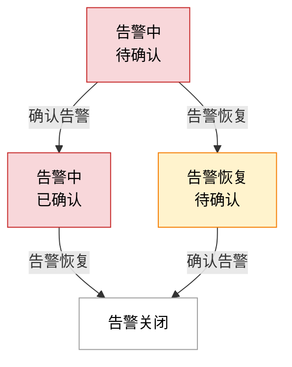

# 告警管理

本指南将带您全面了解 Aqara Studio 的告警服务，涵盖告警的配置、查看与处理。通过对所有接入设备的不间断实时监控，**告警中心**集中展示各类告警信息，助您及时发现并处理潜在风险，保障智能空间的安全与稳定运行。

## 概述

Aqara Studio 提供全面的告警监控与管理功能，支持预置规则与自定义告警策略配置，覆盖设备异常、数据越界等场景，帮助用户实时感知系统风险并快速响应。

- **灵活条件设置**：支持通过逻辑表达式（如“与/或/非”）、数值比较（大于、小于、等于）、时间范围等组合配置告警触发条件。
- **多维度参数绑定**：可关联设备属性（如温度、湿度）、环境变量（如时间段、地理位置）或业务参数（如设备运行模式），实现动态告警触发。
- **典型配置示例**：
  - 当设备温度持续 5 分钟超过 80℃ 时，触发“高温告警”。
  - 当设备功耗瞬时值低于 10W 时，触发“低功耗异常告警”。
  - 当设备处于“夜间模式”且检测到移动信号时，触发“夜间入侵告警”。

## 告警类型

告警可分为两大类，系统默认告警和功能点自定义告警：

| 维度 | 系统默认告警 | 功能点自定义告警 |
| -- | -- | -- |
| 含义 | 针对设备基础运行状态的告警，如通信异常、设备掉线等 | 针对设备的特定功能点（如温度、湿度、电量等）的值进行告警。 |
| 由谁配置 | Aqara Studio | 用户 |
| 可配置性 | 不可修改 | 可创建、修改、删除 |
| 触发条件 | 通信异常、设备掉线 | 设备功能点值满足用户自定义的告警规则 |
| 子类 | <ul><li>协议类系统默认告警（Communication Link Alarm）：通信链路异常时产生的告警。</li><li>设备类系统默认告警（Device Alarm Class）：设备离线时产生的告警。</li></ul> | <ul><li>Normal</li><li>Urgent</li><li>Important</li><li>自定义的类别名称</li></ul> |

:::tip
系统默认告警用于保障平台和设备的基础可用性，规则由系统统一维护，用户无法修改或删除。
:::

### 功能点告警配置指南

请参考 [配置功能点告警](./device-management/alarms.mdx) 文档，了解如何针对设备的功能点，灵活配置和自定义告警规则，以实现对异常状态的实时监控和及时响应。

## 告警确认流程

1. 在左侧导航栏点击进入**告警中心**，页面将集中展示当前所有告警列表。
2. 告警信息主要包含以下字段：

   | 字段           | 说明                                                        |
   | -------------- | ----------------------------------------------------------- |
   | 告警时间       | 告警发生的具体时间。                                        |
   | 告警 ID        | 告警的唯一表示。                                  |
   | 告警源         | 触发告警的来源。不同类型的告警显示的内容各异，自定义告警可通过双击查看具体设备信息。 |
   | 告警状态       | 当前告警的状态，包括：<ul><li>正常</li><li>异常</li></ul>  |
   | 告警类别       | 告警的分类，详见 [告警类型](#告警类型) 说明。                |
   | 告警数据       | 告警的详细数据内容；针对不同类型告警，字段各有侧重。           |
   | 优先级         | 告警的紧急程度。                                            |
   | 恢复正常时间   | 告警解除、恢复为正常时的时间。                               |
   | 告警确认状态   | 是否已确认该告警，包括：<ul><li>未确认</li><li>已确认</li><li>确认待处理</li></ul> |
   | 告警确认时间   | 告警被确认的时间节点。                                      |
   | 告警处理者     | 执行确认操作的用户信息。                                    |
   | 最后更新时间   | 告警信息最近一次的更新时间。                                 |

3. 双击任一告警，可弹出详情窗口，展示该告警的完整信息。对于功能点自定义告警，可在该窗口中准确定位出是哪个设备的哪个功能点触发了本次告警。
4. 在详情弹窗下方，点击**确认告警**按钮，表示该告警已被知悉。此后，告警的确认状态将变更为`已确认`或`确认待处理`。
5. 按照告警内容提示，您可进一步排查并处理发生的协议异常、设备离线等问题。当根本原因排除后，告警状态会从`异常`自动切换为`正常`。

## 告警生命周期

告警的生命周期可分为“告警中-待确认”“告警中-已确认”“告警恢复-待确认”和“告警关闭”四个阶段。告警的流转既与告警本身是否已恢复有关，也与确认操作相关。整体流程如下图所示：

各阶段说明：

- **告警中-待确认**：产生新告警，且用户还未确认，表示需要关注和处理此告警。
- **告警中-已确认**：告警仍存在，但用户已知晓，表示正在处理此告警。
- **告警恢复-待确认**：告警已恢复正常，但用户还未确认，表示告警事件需用户确认后才能关闭。
- **告警关闭**：告警已恢复正常，且用户已确认，该告警事件关闭。

## 告警中心使用说明

