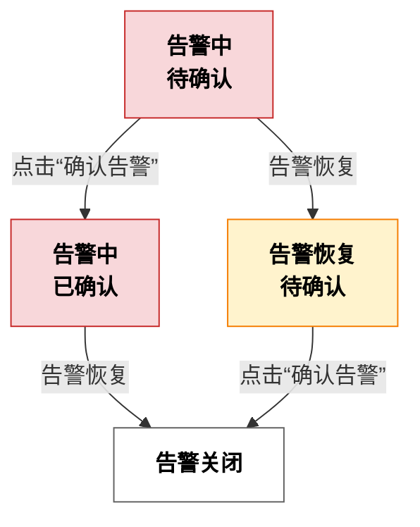

# 配置功能点告警

在智能家居系统的设备管理中，针对每个功能点，Aqara Studio 支持您灵活配置和自定义告警规则，以实现对异常状态的实时监控和及时响应。本文将介绍如何为不同类型的数据点设置多样化的告警类别、触发条件及告警文案，助您更高效地保障设备安全与系统稳定。

## 告警配置流程

1. 进入 **设备管理** 页面，在左侧设备树找到你想要查看的功能点文件夹。
2. 双击该功能点文件夹，切换至该功能点的 **概览** 选项卡。
3. 找到 **告警配置** 区域，单击 **+** 按钮。
4. 在弹窗中配置如下参数：

    | 参数         | 说明                                                         |
    |------------|------------------------------------------------------------|
    | 源名称      | 告警的自定义名称。                                           |
    | 告警值      | 功能点达到该值时触发告警。当为布尔型功能点时，此参数为单选；当为枚举型功能点时，可多选。                                     |
    | 告警类型    | 告警级别，可选 Normal、Urgent、Important ，也支持自定义类型。    |
    | 延迟时间    | 指定功能点满足告警条件后，若在此时间段内始终未恢复正常，系统才会向用户发出告警。可用于避免因短暂波动导致的误报。 |
    | 正常延迟时间 | 功能点脱离告警状态后，需在设定延迟时间内未再次发生异常，才会判定为已恢复正常并向用户提示，以避免异常短暂波动频繁提醒。 |
    | 偏离正常文本 | 触发告警时显示给用户的提示内容。                               |
    | 恢复正常文本 | 恢复正常后显示给用户的提示内容。                               |

    当功能点为数值型时，还有以下参数：

    | 参数         | 说明                                                         |
    |------------|------------------------------------------------------------|
    | 限制启用     | 选择启用下限，上限或都启用。         |
    | 下限     | 规定正常数值的下限。         |
    | 上限     | 规定正常数值的上限。         |
    | 死区     | 指以上限或下限为中心，在 ±一定阈值范围内 输入变化不会引起系统响应或输出变化的区间，用于避免抖动和误触发。         |

    完成配置后，单击确认，可以看到**告警配置**区域多了一个卡片。
5. 单击卡片上的 toggle 按钮，即可启用该告警配置。
6. 告警启用后，一旦设备功能点数值达到设定的告警条件，告警配置卡片将自动展示告警提示、状态、发生时间及确认按钮。您可点击确认按钮，快速知晓该告警。
    :::tip
    您也可以前往 [告警中心](./../alarm-management.mdx) 查看告警的详细信息，如告警数据、恢复正常时间、告警确认时间等。 
    :::

## 告警生命周期

在功能点配置页面的 **告警配置** 区域，您可以通过告警配置卡片实时查看当前告警的状态，直观了解其所处的生命周期阶段。

告警的生命周期可分为“告警中-待确认”“告警中-已确认”“告警恢复-待确认”和“告警关闭”四个阶段。告警的流转既与告警本身是否已恢复正常有关，也与用户是否确认相关。整体流程如下图所示：

各阶段说明：

- **告警中-待确认**：产生新告警，且用户还未确认，表示需要关注和处理此告警。
- **告警中-已确认**：告警仍存在，但用户已知晓，表示正在处理此告警。
- **告警恢复-待确认**：告警已恢复正常，但用户还未确认，表示告警事件需用户确认后才能关闭。
- **告警关闭**：告警已恢复正常，且用户已确认，该告警事件关闭。

## 常见问题

### 为什么在 Aqara Studio 中告警被确认后，系统仍会继续提示告警？

由于设备功能点的数值未发生变化，依然处于符合告警条件的状态，因此即使您手动确认了告警，Aqara Studio 仍会持续发出告警提示。只有当该功能点的数值恢复至正常后，系统才会自动终止告警提示。