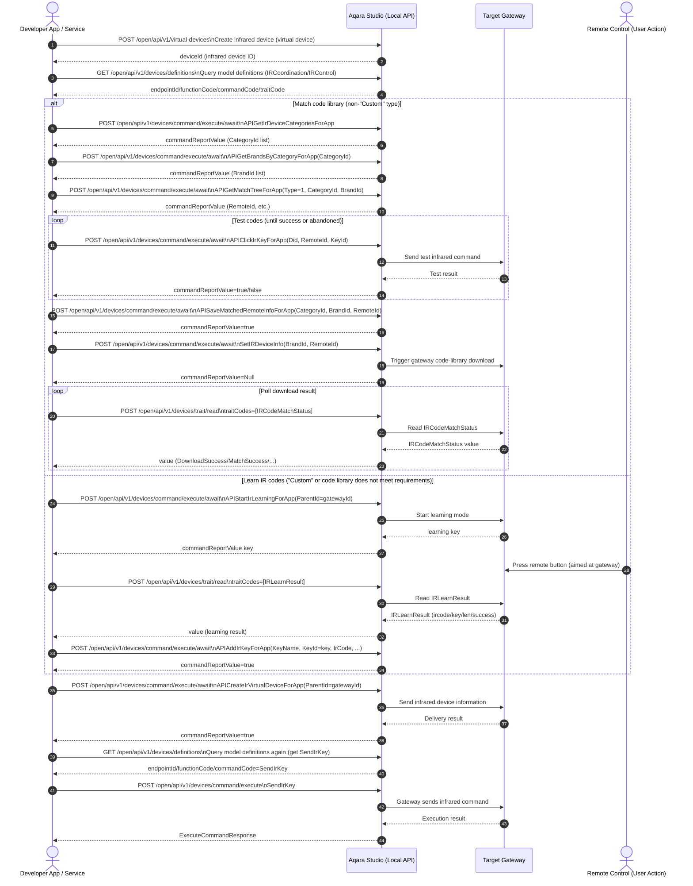

# Infrared Device Integration

This article describes how to integrate infrared devices into Aqara Studio through the local Studio API, so that the gateway can send infrared commands to control infrared devices.

## Sequence Diagram



## 1 Create an Infrared Device

Use the Studio local API [`POST` /open/api/v1/virtual-devices](./../../data-export-api/add-virtual-device.api.mdx) to create an infrared device and obtain its device ID.

## 2 Query Device Model Definitions

Use the Studio local API [`GET` /open/api/v1/devices/definitions](./../../data-export-api/get-device-definitions.api.mdx), passing in the infrared device ID and target gateway ID, to query the device model definitions and obtain the **endpointId**, **functionCode**, and **commandCode** required for subsequent operations.

Common `commandCode` values are described below:

| Category | Function | `commandCode` or `traitCode` |
|------------|-----------------|-----------------------------|
| Infrared Device | Get device types | `APIGetIrDeviceCategoriesForApp` |
| Infrared Device | Get brands | `APIGetBrandsByCategoryForApp` |
| Infrared Device | Get match tree | `APIGetMatchTreeForApp` |
| Infrared Device | Test codes | `APIClickIrKeyForApp` |
| Infrared Device | Save matching result | `APISaveMatchedRemoteInfoForApp` |
| Infrared Device | Send infrared device info to gateway | `APICreateIrVirtualDeviceForApp` |
| Infrared Device | Start learning | `APIStartIrLearningForApp` |
| Infrared Device | Save learned key | `APIAddIrKeyForApp` |
| Infrared Device | Routine control | `SendIrKey` <br />**Note**: This command appears only after matching is completed. You must query the device model definitions again after matching to obtain it. |
| Gateway | Download code library | `SetIRDeviceInfo` |
| Gateway | Query download result | `IRCodeMatchStatus` |
| Gateway | Read learning result | `IRLearnResult` |

The following is an example of infrared device details:
```json {15,20,24,30,46,110,140,183}
{
  "type": "GetDevicesResponse",
  "version": "v1",
  "msgId": "2",
  "data": [
    {
      "deviceId": "virtual.1782388251128",
      "name": "Test1",
      "gatewayId": "",
      "deviceTypesList": [
        "IRDevice"
      ],
      "endpoints": [
        {
          "endpointId": 2,
          "endpointName": "IRCoordination",
          "deviceType": "IRDevice",
          "functions": [
            {
              "functionCode": "IRCoordination",
              "traits": [],
              "commands": [
                {
                  "commandCode": "APIGetIrDeviceCategoriesForApp",
                  "fields": [],
                  "description": "Get a list of infrared device types",
                  "pointName": "IR Remote Control Coordination - Get a list of infrared device types"
                },
                {
                  "commandCode": "APIGetBrandsByCategoryForApp",
                  "fields": [
                    {
                      "fieldCode": "CategoryId",
                      "parameter": {
                        "type": "Integer",
                        "mandatory": true,
                        "min": 1,
                        "max": 13
                      }
                    }
                  ],
                  "description": "Get a list of brands by device type",
                  "pointName": "IR Remote Control Coordination - Get a list of brands based on device type"
                },
                {
                  "commandCode": "APIGetMatchTreeForApp",
                  "fields": [
                    {
                      "fieldCode": "Type",
                      "parameter": {
                        "type": "Enum",
                        "mandatory": true,
                        "supportedValues": [
                          {
                            "key": "CategoryTree",
                            "value": "1"
                          },
                          {
                            "key": "SpsCityTree",
                            "value": "2"
                          },
                          {
                            "key": "IptvTree",
                            "value": "3"
                          }
                        ]
                      }
                    },
                    {
                      "fieldCode": "CategoryId",
                      "parameter": {
                        "type": "Integer",
                        "mandatory": true,
                        "min": 1,
                        "max": 13
                      }
                    },
                    {
                      "fieldCode": "BrandId",
                      "parameter": {
                        "type": "Integer",
                        "mandatory": true,
                        "min": 0,
                        "max": 99999
                      }
                    },
                    {
                      "fieldCode": "CityId",
                      "parameter": {
                        "type": "Integer",
                        "mandatory": false,
                        "min": 0,
                        "max": 999999
                      }
                    },
                    {
                      "fieldCode": "SpId",
                      "parameter": {
                        "type": "Integer",
                        "mandatory": false,
                        "min": 0,
                        "max": 99999
                      }
                    }
                  ],
                  "description": "Get match tree",
                  "pointName": "IR Remote Control Coordination - Get matching tree information"
                },
                {
                  "commandCode": "APIClickIrKeyForApp",
                  "fields": [
                    {
                      "fieldCode": "Did",
                      "parameter": {
                        "type": "String",
                        "mandatory": true
                      }
                    },
                    {
                      "fieldCode": "RemoteId",
                      "parameter": {
                        "type": "Integer",
                        "mandatory": true,
                        "min": 0,
                        "max": 999999
                      }
                    },
                    {
                      "fieldCode": "KeyId",
                      "parameter": {
                        "type": "String",
                        "mandatory": true
                      }
                    }
                  ],
                  "description": "key control",
                  "pointName": "IR Remote Control Coordination - Click the remote control button"
                },
                {
                  "commandCode": "APISaveMatchedRemoteInfoForApp",
                  "fields": [
                    {
                      "fieldCode": "CategoryId",
                      "parameter": {
                        "type": "Integer",
                        "mandatory": true,
                        "min": 1,
                        "max": 13
                      }
                    },
                    {
                      "fieldCode": "BrandId",
                      "parameter": {
                        "type": "Integer",
                        "mandatory": false,
                        "min": 0,
                        "max": 99999
                      }
                    },
                    {
                      "fieldCode": "RemoteId",
                      "parameter": {
                        "type": "Integer",
                        "mandatory": false,
                        "min": 0,
                        "max": 999999
                      }
                    },
                    {
                      "fieldCode": "SpId",
                      "parameter": {
                        "type": "Integer",
                        "mandatory": false,
                        "min": 0,
                        "max": 99999
                      }
                    }
                  ],
                  "description": "save virtual brand info",
                  "pointName": "IR Remote Control Coordination - Save Successfully Matched Remote Control Information"
                },
                {
                  "commandCode": "APICreateIrVirtualDeviceForApp",
                  "fields": [
                    {
                      "fieldCode": "ParentId",
                      "parameter": {
                        "type": "String",
                        "mandatory": true
                      }
                    }
                  ],
                  "description": "Create a localized virtual infrared-code device",
                  "pointName": "IR Remote Control Coordination - Create a localized infrared code virtual device"
                },
                {
                  "commandCode": "APIAddIrKeyForApp",
                  "fields": [
                    {
                      "fieldCode": "KeyName",
                      "parameter": {
                        "type": "String",
                        "mandatory": true
                      }
                    },
                    {
                      "fieldCode": "KeyId",
                      "parameter": {
                        "type": "String",
                        "mandatory": true
                      }
                    },
                    {
                      "fieldCode": "IrCode",
                      "parameter": {
                        "type": "String",
                        "mandatory": true
                      }
                    },
                    {
                      "fieldCode": "Freq",
                      "parameter": {
                        "type": "String",
                        "mandatory": false
                      }
                    },
                    {
                      "fieldCode": "Len",
                      "parameter": {
                        "type": "Integer",
                        "mandatory": false,
                        "min": 0,
                        "max": 2000
                      }
                    }
                  ],
                  "description": "Add remote-control buttons",
                  "pointName": "IR Remote Control Coordination - Add buttons to the remote control"
                },
                {
                  "commandCode": "APIStartIrLearningForApp",
                  "fields": [
                    {
                      "fieldCode": "ParentId",
                      "parameter": {
                        "type": "String",
                        "mandatory": true
                      }
                    }
                  ],
                  "description": "Start infrared learning",
                  "pointName": "IR Remote Control Coordination - Start infrared code learning"
                }
              ]
            }
          ]
        }
      ]
    }
  ],
  "code": 0,
  "message": "success"
}
```

The following is an example of gateway device details:
```json {19,24,253,137,172}
{
  "type": "GetDevicesResponse",
  "version": "v1",
  "msgId": "1",
  "data": [
    {
      "deviceId": "lumi3.a61fca0f4da1a0bd",
      "name": "Edge Hub M300",
      "gatewayId": "lumi3.a61fca0f4da1a0bd",
      "deviceTypesList": [
        "Hub",
        "SpaceSecurity",
        "AirConditioner",
        "IRDevice"
      ],
      "endpoints": [
        ...
        {
          "endpointId": 5,
          "endpointName": "IR Device",
          "deviceType": "IRDevice",
          "functions": [
            {
              "functionCode": "IRControl",
              "traits": [
                {
                  "traitCode": "IRKey",
                  "parameter": {
                    "type": "Enum",
                    "readable": false,
                    "writable": true,
                    "subscribable": false,
                    "supportedValues": [
                      {
                        "key": "Reserved",
                        "value": "0"
                      },
                      {
                        "key": "Power",
                        "value": "1"
                      },
                      {
                        "key": "Mode",
                        "value": "2"
                      },
                      {
                        "key": "Temp+",
                        "value": "3"
                      },
                      {
                        "key": "Temp-",
                        "value": "4"
                      },
                      {
                        "key": "WindSpeed",
                        "value": "5"
                      },
                      {
                        "key": "P_KEY",
                        "value": "9637"
                      }
                    ],
                    "unit": ""
                  },
                  "value": "0",
                  "time": 1782442722197,
                  "pointName": "Infrared Commands"
                },
                {
                  "traitCode": "IRType",
                  "parameter": {
                    "type": "Enum",
                    "readable": true,
                    "writable": true,
                    "subscribable": true,
                    "supportedValues": [
                      {
                        "key": "AirConditioner",
                        "value": "0"
                      },
                      {
                        "key": "TV",
                        "value": "1"
                      },
                      {
                        "key": "Fan",
                        "value": "2"
                      },
                      {
                        "key": "TVBox",
                        "value": "3"
                      },
                      {
                        "key": "Projector",
                        "value": "4"
                      },
                      {
                        "key": "SettopBox",
                        "value": "5"
                      },
                      {
                        "key": "DVD",
                        "value": "6"
                      },
                      {
                        "key": "Heater",
                        "value": "7"
                      },
                      {
                        "key": "AirPurifier",
                        "value": "8"
                      },
                      {
                        "key": "Speaker",
                        "value": "9"
                      },
                      {
                        "key": "Lighting",
                        "value": "10"
                      },
                      {
                        "key": "Camera",
                        "value": "11"
                      },
                      {
                        "key": "Customize",
                        "value": "12"
                      }
                    ],
                    "unit": ""
                  },
                  "value": "0",
                  "time": 1782442722204,
                  "pointName": "Infrared type"
                },
                {
                  "traitCode": "IRCodeMatchStatus",
                  "parameter": {
                    "type": "Enum",
                    "readable": true,
                    "writable": false,
                    "subscribable": true,
                    "supportedValues": [
                      {
                        "key": "Default",
                        "value": "0"
                      },
                      {
                        "key": "MatchSuccess",
                        "value": "1"
                      },
                      {
                        "key": "MatchFailure",
                        "value": "2"
                      },
                      {
                        "key": "Redownload",
                        "value": "3"
                      },
                      {
                        "key": "DownloadSuccess",
                        "value": "4"
                      }
                    ],
                    "unit": ""
                  },
                  "value": "4",
                  "time": 1782442722206,
                  "pointName": "Infrared Code Match Status"
                },
                {
                  "traitCode": "IRLearnResult",
                  "parameter": {
                    "type": "Struct",
                    "readable": true,
                    "writable": false,
                    "subscribable": true,
                    "unit": ""
                  },
                  "value": "",
                  "time": 1782442722214,
                  "pointName": "IR Learning Result"
                }
              ],
              "commands": [
                {
                  "commandCode": "SendIRCode",
                  "fields": [
                    {
                      "fieldCode": "Mode",
                      "parameter": {
                        "type": "Enum",
                        "mandatory": true,
                        "supportedValues": [
                          {
                            "key": "mode0",
                            "value": "0"
                          },
                          {
                            "key": "mode1",
                            "value": "1"
                          }
                        ]
                      }
                    },
                    {
                      "fieldCode": "BrandId",
                      "parameter": {
                        "type": "Integer",
                        "mandatory": true
                      }
                    },
                    {
                      "fieldCode": "RemoteId",
                      "parameter": {
                        "type": "Integer",
                        "mandatory": true
                      }
                    },
                    {
                      "fieldCode": "IRCode",
                      "parameter": {
                        "type": "String",
                        "mandatory": false
                      }
                    },
                    {
                      "fieldCode": "IRCodeLength",
                      "parameter": {
                        "type": "Integer",
                        "mandatory": false
                      }
                    },
                    {
                      "fieldCode": "ACKey",
                      "parameter": {
                        "type": "String",
                        "mandatory": false
                      }
                    },
                    {
                      "fieldCode": "Frequency",
                      "parameter": {
                        "type": "Integer",
                        "mandatory": true
                      }
                    }
                  ],
                  "description": "Send infrared command",
                  "pointName": "Send infrared commands"
                },
                {
                  "commandCode": "SetIRDeviceInfo",
                  "fields": [
                    {
                      "fieldCode": "BrandId",
                      "parameter": {
                        "type": "Integer",
                        "mandatory": true,
                        "min": 0,
                        "max": 4294967295,
                        "step": 1
                      }
                    },
                    {
                      "fieldCode": "RemoteId",
                      "parameter": {
                        "type": "Integer",
                        "mandatory": true,
                        "min": 0,
                        "max": 4294967295
                      }
                    },
                    {
                      "fieldCode": "ACMode",
                      "parameter": {
                        "type": "Integer",
                        "mandatory": false,
                        "min": 0,
                        "max": 4294967295,
                        "step": 1
                      }
                    },
                    {
                      "fieldCode": "ACType",
                      "parameter": {
                        "type": "Integer",
                        "mandatory": false,
                        "min": 0,
                        "max": 4294967295,
                        "step": 1
                      }
                    }
                  ],
                  "description": "Configure infrared device information",
                  "pointName": "Configure infrared device information"
                }
              ]
            }
          ]
        }
      ]
    }
  ],
  "code": 0,
  "message": "success"
}
```

## 3 Match an IR Code Library


### 3.1 Get Device Types

First, assign a device type to the newly created infrared device, such as an air conditioner or fan, so it matches the real device type you want to control.

Call the Studio local API [`POST` /open/api/v1/devices/command/execute/await](./../../data-export-api/execute-device-command-await.api.mdx) with `commandCode` set to `APIGetIrDeviceCategoriesForApp` and `data.args` set to `[]` to retrieve the list of infrared device types currently supported by Aqara Studio.

The following is an example request body (JSON):

```json
{
  "data": [
    {
      "deviceId": "virtual.1782462773707",
      "endpointId": 2,
      "functionCode": "IRCoordination",
      "commandCode": "APIGetIrDeviceCategoriesForApp",
      "args": []
    }
  ],
  "timeoutMs": 0
}
```

The following is an example response body (JSON):

```json {14}
{
  "type": "ExecuteCommandAwaitResponse",
  "version": "v1",
  "msgId": "16",
  "data": [
    {
      "deviceId": "virtual.1782462773707",
      "endpointId": 2,
      "functionCode": "IRCoordination",
      "commandCode": "APIGetIrDeviceCategoriesForApp",
      "code": 0,
      "message": "success",
      "responded": true,
      "commandReportValue": "[{\"id\":2,\"code\":\"TV\",\"name\":\"TV\",\"model\":\"virtual.models.tv\"},{\"id\":3,\"code\":\"BOX\",\"name\":\"Set-Top Box\",\"model\":\"virtual.models.box\"},{\"id\":4,\"code\":\"DVD\",\"name\":\"DVD\",\"model\":\"virtual.models.dvd\"},{\"id\":5,\"code\":\"AC\",\"name\":\"Air Conditioner\",\"model\":\"virtual.models.ac\"},{\"id\":6,\"code\":\"Pro\",\"name\":\"Projector\",\"model\":\"virtual.models.pro\"},{\"id\":7,\"code\":\"PA\",\"name\":\"Speaker\",\"model\":\"virtual.models.pa\"},{\"id\":8,\"code\":\"FAN\",\"name\":\"Fan\",\"model\":\"virtual.models.fan\"},{\"id\":9,\"code\":\"SLR\",\"name\":\"Camera\",\"model\":\"virtual.models.slr\"},{\"id\":10,\"code\":\"Light\",\"name\":\"Smart Light\",\"model\":\"virtual.models.light\"},{\"id\":11,\"code\":\"AirCleaner\",\"name\":\"Air Purifier\",\"model\":\"virtual.models.aircleaner\"},{\"id\":12,\"code\":\"WaterHeater\",\"name\":\"Water Heater\",\"model\":\"virtual.models.waterheater\"},{\"id\":13,\"code\":\"default\",\"name\":\"Custom\",\"model\":\"virtual.models.default\"}]",
      "responseTime": 1782464191572
    }
  ],
  "code": 0
}
```

After deserializing the `data.commandReportValue` field into an array, you can obtain the supported infrared device types (`id`, `code`, `name`, and `model`). Choose the appropriate type based on your actual needs.

The following is an example of the deserialized array:

```json
[
  {"id":2,"code":"TV","name":"TV","model":"virtual.models.tv"},
  {"id":3,"code":"BOX","name":"Set-Top Box","model":"virtual.models.box"},
  {"id":4,"code":"DVD","name":"DVD","model":"virtual.models.dvd"},
  {"id":5,"code":"AC","name":"Air Conditioner","model":"virtual.models.ac"},
  {"id":6,"code":"Pro","name":"Projector","model":"virtual.models.pro"},
  {"id":7,"code":"PA","name":"Speaker","model":"virtual.models.pa"},
  {"id":8,"code":"FAN","name":"Fan","model":"virtual.models.fan"},
  {"id":9,"code":"SLR","name":"Camera","model":"virtual.models.slr"},
  {"id":10,"code":"Light","name":"Smart Light","model":"virtual.models.light"},
  {"id":11,"code":"AirCleaner","name":"Air Purifier","model":"virtual.models.aircleaner"},
  {"id":12,"code":"WaterHeater","name":"Water Heater","model":"virtual.models.waterheater"},
  {"id":13,"code":"default","name":"Custom","model":"virtual.models.default"}
]
```

Select the appropriate type from the list and record the relevant fields for later steps.

If you choose the **Custom** type, skip directly to [Learn IR Codes](#4-learn-ir-codes).

### 3.2 Get Brands

After determining the infrared device type, the next step is to retrieve the list of brands for that type, such as Gree or Midea, for the subsequent IR code matching process.

Use the Studio local API [`POST` /open/api/v1/devices/command/execute/await](./../../data-export-api/execute-device-command-await.api.mdx), set `commandCode` to `APIGetBrandsByCategoryForApp`, and provide the following parameters in the `data.args` array:

| Parameter | Type | Required | Description |
| ------------ | -------- | -------- | ---------------------------------------------------------------------------- |
| CategoryId | integer | Yes | Enter the `commandReportValue.id` returned by [Get Device Types](#31-get-device-types). |

The following is an example request body (JSON):
```json
// Get the brand list for fans
{
  "data": [
    {
      "deviceId": "virtual.1782462773707",
      "endpointId": 2,
      "functionCode": "IRCoordination",
      "commandCode": "APIGetBrandsByCategoryForApp",
      "args": [
        {
          "fieldCode": "CategoryId",
          "value": 8
        }
      ]
    }
  ],
  "timeoutMs": 0
}
```

The following is an example response body (JSON):
```json {14}
{
  "type": "ExecuteCommandAwaitResponse",
  "version": "v1",
  "msgId": "17",
  "data": [
    {
      "deviceId": "virtual.1782462773707",
      "endpointId": 2,
      "functionCode": "IRCoordination",
      "commandCode": "APIGetBrandsByCategoryForApp",
      "code": 0,
      "message": "success",
      "responded": true,
      "commandReportValue": "[{\"pinyin\":\"tianmin\",\"brandId\":1077,\"name\":\"10moons\",\"enName\":\"10moons\"},{\"pinyin\":\"m\",\"brandId\":1867,\"name\":\"3M\",\"enName\":\"3M\"},{\"pinyin\":\"shimisi\",\"brandId\":208,\"name\":\"A.O.Smith\",\"enName\":\"A.O.Smith\"},{\"pinyin\":\"aaf\",\"brandId\":224,\"name\":\"AAF\",\"enName\":\"AAF\"},{\"pinyin\":\"aimeite\",\"brandId\":2602,\"name\":\"Airmate\",\"enName\":\"Airmate\"},{\"pinyin\":\"alpha\",\"brandId\":225,\"name\":\"Alpha\",\"enName\":\"Alpha\"},{\"pinyin\":\"yamosi\",\"brandId\":2637,\"name\":\"Amos\",\"enName\":\"Amos\"},{\"pinyin\":\"aolisi\",\"brandId\":153,\"name\":\"Aonice\",\"enName\":\"Aonice\"},{\"pinyin\":\"atomberg\",\"brandId\":2354,\"name\":\"Atomberg\",\"enName\":\"Atomberg\"},{\"pinyin\":\"aokema\",\"brandId\":102,\"name\":\"Aucma\",\"enName\":\"Aucma\"},{\"pinyin\":\"aokesi\",\"brandId\":192,\"name\":\"Aux\",\"enName\":\"Aux\"},{\"pinyin\":\"aiweiyaer\",\"brandId\":2541,\"name\":\"AVIAIR\",\"enName\":\"AVIAIR\"},{\"pinyin\":\"baihua\",\"brandId\":397,\"name\":\"Baihua\",\"enName\":\"Baihua\"},{\"pinyin\":\"baili\",\"brandId\":2822,\"name\":\"Baili\",\"enName\":\"Baili\"},{\"pinyin\":\"bailang\",\"brandId\":186,\"name\":\"Bairan\",\"enName\":\"Bairan\"},{\"pinyin\":\"beili\",\"brandId\":185,\"name\":\"Beili\",\"enName\":\"Beili\"},{\"pinyin\":\"bianfu\",\"brandId\":223,\"name\":\"Bianfu\",\"enName\":\"Bianfu\"},{\"pinyin\":\"luotuo\",\"brandId\":2642,\"name\":\"Camel\",\"enName\":\"Camel\"},{\"pinyin\":\"changhong\",\"brandId\":17,\"name\":\"Changhong\",\"enName\":\"Changhong\"},{\"pinyin\":\"zhigao\",\"brandId\":197,\"name\":\"Chigo\",\"enName\":\"Chigo\"},{\"pinyin\":\"jimei\",\"brandId\":832,\"name\":\"CHIMEI\",\"enName\":\"CHIMEI\"},{\"pinyin\":\"zuanshi\",\"brandId\":2667,\"name\":\"Diamond\",\"enName\":\"Diamond\"},{\"pinyin\":\"dier\",\"brandId\":188,\"name\":\"Dier\",\"enName\":\"Dier\"},{\"pinyin\":\"duoli\",\"brandId\":2672,\"name\":\"Duoli\",\"enName\":\"Duoli\"},{\"pinyin\":\"daisen\",\"brandId\":4959,\"name\":\"Dyson\",\"enName\":\"Dyson\"},{\"pinyin\":\"yilaikesi\",\"brandId\":137,\"name\":\"Electrolux\",\"enName\":\"Electrolux\"},{\"pinyin\":\"yongsheng\",\"brandId\":2677,\"name\":\"Eosn\",\"enName\":\"Eosn\"},{\"pinyin\":\"europace\",\"brandId\":221,\"name\":\"EuropAce\",\"enName\":\"EuropAce\"},{\"pinyin\":\"feidie\",\"brandId\":220,\"name\":\"Feidie\",\"enName\":\"Feidie\"},{\"pinyin\":\"xinfei\",\"brandId\":1437,\"name\":\"Frestec\",\"enName\":\"Frestec\"},{\"pinyin\":\"fushibao\",\"brandId\":2622,\"name\":\"Fushibao\",\"enName\":\"Fushibao\"},{\"pinyin\":\"changcheng\",\"brandId\":357,\"name\":\"Great Wall\",\"enName\":\"Great Wall\"},{\"pinyin\":\"geli\",\"brandId\":97,\"name\":\"Gree\",\"enName\":\"Gree\"},{\"pinyin\":\"haier\",\"brandId\":37,\"name\":\"Haier\",\"enName\":\"Haier\"},{\"pinyin\":\"huikang\",\"brandId\":1522,\"name\":\"Hicon\",\"enName\":\"Hicon\"},{\"pinyin\":\"huoniweier\",\"brandId\":3451,\"name\":\"Honeywell\",\"enName\":\"Honeywell\"},{\"pinyin\":\"huipu\",\"brandId\":1902,\"name\":\"HP\",\"enName\":\"HP\"},{\"pinyin\":\"huabao\",\"brandId\":592,\"name\":\"Huabao\",\"enName\":\"Huabao\"},{\"pinyin\":\"huicheng\",\"brandId\":2717,\"name\":\"Huicheng\",\"enName\":\"Huicheng\"},{\"pinyin\":\"xiandai\",\"brandId\":922,\"name\":\"Hyundai\",\"enName\":\"Hyundai\"},{\"pinyin\":\"riben\",\"brandId\":195,\"name\":\"Japan\",\"enName\":\"Japan\"},{\"pinyin\":\"jiling\",\"brandId\":16,\"name\":\"Jiling\",\"enName\":\"Jiling\"},{\"pinyin\":\"jinling\",\"brandId\":216,\"name\":\"Jinling\",\"enName\":\"Jinling\"},{\"pinyin\":\"jinlong\",\"brandId\":215,\"name\":\"Jinlong\",\"enName\":\"Jinlong\"},{\"pinyin\":\"jinshikang\",\"brandId\":189,\"name\":\"jinshikang\",\"enName\":\"jinshikang\"},{\"pinyin\":\"jinsong\",\"brandId\":1172,\"name\":\"Jinsong\",\"enName\":\"Jinsong\"},{\"pinyin\":\"jiuhehongsheng\",\"brandId\":190,\"name\":\"Juhehongsheng\",\"enName\":\"Juhehongsheng\"},{\"pinyin\":\"juhua\",\"brandId\":752,\"name\":\"JUHUA\",\"enName\":\"JUHUA\"},{\"pinyin\":\"jiebao\",\"brandId\":218,\"name\":\"Jyeproud\",\"enName\":\"Jyeproud\"},{\"pinyin\":\"kadiya\",\"brandId\":214,\"name\":\"Kadder\",\"enName\":\"Kadder\"},{\"pinyin\":\"kdk\",\"brandId\":2827,\"name\":\"KDK\",\"enName\":\"KDK\"},{\"pinyin\":\"kelong\",\"brandId\":577,\"name\":\"Kelon\",\"enName\":\"Kelon\"},{\"pinyin\":\"gelin\",\"brandId\":657,\"name\":\"Kolin\",\"enName\":\"Kolin\"},{\"pinyin\":\"kangjia\",\"brandId\":42,\"name\":\"Konka\",\"enName\":\"Konka\"},{\"pinyin\":\"lasike\",\"brandId\":191,\"name\":\"Lasko\",\"enName\":\"Lasko\"},{\"pinyin\":\"lianchuang\",\"brandId\":2607,\"name\":\"Lianchuang\",\"enName\":\"Lianchuang\"},{\"pinyin\":\"lijing\",\"brandId\":184,\"name\":\"Lijing\",\"enName\":\"Lijing\"},{\"pinyin\":\"xiaoya\",\"brandId\":1422,\"name\":\"Littleduck\",\"enName\":\"Littleduck\"},{\"pinyin\":\"xiaotiane\",\"brandId\":2657,\"name\":\"Littleswan\",\"enName\":\"Littleswan\"},{\"pinyin\":\"longsheng\",\"brandId\":2652,\"name\":\"Longsheng\",\"enName\":\"Longsheng\"},{\"pinyin\":\"mali\",\"brandId\":213,\"name\":\"Mali\",\"enName\":\"Mali\"},{\"pinyin\":\"meidisi\",\"brandId\":193,\"name\":\"Medis\",\"enName\":\"Medis\"},{\"pinyin\":\"meiling\",\"brandId\":1262,\"name\":\"Meiling\",\"enName\":\"Meiling\"},{\"pinyin\":\"meidi\",\"brandId\":182,\"name\":\"Midea\",\"enName\":\"Midea\"},{\"pinyin\":\"milux\",\"brandId\":194,\"name\":\"MILUX\",\"enName\":\"MILUX\"},{\"pinyin\":\"sanling\",\"brandId\":107,\"name\":\"Mitsubishi\",\"enName\":\"Mitsubishi\"},{\"pinyin\":\"shuixian\",\"brandId\":2513,\"name\":\"Narcissus\",\"enName\":\"Narcissus\"},{\"pinyin\":\"lesheng\",\"brandId\":3238,\"name\":\"National\",\"enName\":\"National\"},{\"pinyin\":\"riguang\",\"brandId\":1562,\"name\":\"Nikko\",\"enName\":\"Nikko\"},{\"pinyin\":\"aodeer\",\"brandId\":2682,\"name\":\"Odor\",\"enName\":\"Odor\"},{\"pinyin\":\"origo\",\"brandId\":5029,\"name\":\"Origo\",\"enName\":\"Origo\"},{\"pinyin\":\"songxia\",\"brandId\":202,\"name\":\"Panasonic\",\"enName\":\"Panasonic\"},{\"pinyin\":\"feilipu\",\"brandId\":52,\"name\":\"Philips\",\"enName\":\"Philips\"},{\"pinyin\":\"pinnuo\",\"brandId\":211,\"name\":\"Pinoh\",\"enName\":\"Pinoh\"},{\"pinyin\":\"xianfeng\",\"brandId\":62,\"name\":\"Pioneer\",\"enName\":\"Pioneer\"},{\"pinyin\":\"qihua\",\"brandId\":210,\"name\":\"Qihua\",\"enName\":\"Qihua\"},{\"pinyin\":\"ricai\",\"brandId\":1337,\"name\":\"Ricai\",\"enName\":\"Ricai\"},{\"pinyin\":\"huageli\",\"brandId\":219,\"name\":\"Richland\",\"enName\":\"Richland\"},{\"pinyin\":\"rongsheng\",\"brandId\":2687,\"name\":\"Rongsheng\",\"enName\":\"Rongsheng\"},{\"pinyin\":\"rongshida\",\"brandId\":2617,\"name\":\"Royalsta\",\"enName\":\"Royalsta\"},{\"pinyin\":\"yinghua\",\"brandId\":204,\"name\":\"Sakura\",\"enName\":\"Sakura\"},{\"pinyin\":\"shengbao\",\"brandId\":3050,\"name\":\"Sampo\",\"enName\":\"Sampo\"},{\"pinyin\":\"sangpu\",\"brandId\":2692,\"name\":\"Sampux\",\"enName\":\"Sampux\"},{\"pinyin\":\"sanyang\",\"brandId\":232,\"name\":\"Sanyo\",\"enName\":\"Sanyo\"},{\"pinyin\":\"xianke\",\"brandId\":927,\"name\":\"SAST\",\"enName\":\"SAST\"},{\"pinyin\":\"shanhu\",\"brandId\":196,\"name\":\"Shanhu\",\"enName\":\"Shanhu\"},{\"pinyin\":\"xiapu\",\"brandId\":57,\"name\":\"Sharp\",\"enName\":\"Sharp\"},{\"pinyin\":\"shifeng\",\"brandId\":2697,\"name\":\"Shifeng\",\"enName\":\"Shifeng\"},{\"pinyin\":\"saiyi\",\"brandId\":2627,\"name\":\"Shinee\",\"enName\":\"Shinee\"},{\"pinyin\":\"siyu\",\"brandId\":2702,\"name\":\"Siyu\",\"enName\":\"Siyu\"},{\"pinyin\":\"skg\",\"brandId\":166,\"name\":\"SKG\",\"enName\":\"SKG\"},{\"pinyin\":\"shunfa\",\"brandId\":209,\"name\":\"Sunfar\",\"enName\":\"Sunfar\"},{\"pinyin\":\"datong\",\"brandId\":637,\"name\":\"Tatung\",\"enName\":\"Tatung\"},{\"pinyin\":\"tcl\",\"brandId\":27,\"name\":\"TCL\",\"enName\":\"TCL\"},{\"pinyin\":\"dongyuan\",\"brandId\":617,\"name\":\"TECO\",\"enName\":\"TECO\"},{\"pinyin\":\"delufenggen\",\"brandId\":887,\"name\":\"Telefunken\",\"enName\":\"Telefunken\"},{\"pinyin\":\"tairui\",\"brandId\":198,\"name\":\"TERA\",\"enName\":\"TERA\"},{\"pinyin\":\"tangmuxun\",\"brandId\":882,\"name\":\"Thomson\",\"enName\":\"Thomson\"},{\"pinyin\":\"tianma\",\"brandId\":199,\"name\":\"Tianma\",\"enName\":\"Tianma\"},{\"pinyin\":\"cankun\",\"brandId\":2647,\"name\":\"Tkec\",\"enName\":\"Tkec\"},{\"pinyin\":\"dongbao\",\"brandId\":532,\"name\":\"Tobo\",\"enName\":\"Tobo\"},{\"pinyin\":\"dongzhi\",\"brandId\":22,\"name\":\"Toshiba\",\"enName\":\"Toshiba\"},{\"pinyin\":\"dasong\",\"brandId\":371,\"name\":\"Tosot\",\"enName\":\"Tosot\"},{\"pinyin\":\"toyomi\",\"brandId\":200,\"name\":\"Toyomi\",\"enName\":\"Toyomi\"},{\"pinyin\":\"huasheng\",\"brandId\":2612,\"name\":\"Wahson\",\"enName\":\"Wahson\"},{\"pinyin\":\"woerdun\",\"brandId\":3568,\"name\":\"Walton\",\"enName\":\"Walton\"},{\"pinyin\":\"wanbao\",\"brandId\":1402,\"name\":\"Wanbao\",\"enName\":\"Wanbao\"},{\"pinyin\":\"wotesen\",\"brandId\":3304,\"name\":\"Watson\",\"enName\":\"Watson\"},{\"pinyin\":\"weili\",\"brandId\":1667,\"name\":\"Weili\",\"enName\":\"Weili\"},{\"pinyin\":\"weili\",\"brandId\":206,\"name\":\"Welly\",\"enName\":\"Welly\"},{\"pinyin\":\"xiwu\",\"brandId\":1047,\"name\":\"Westinghouse\",\"enName\":\"Westinghouse\"},{\"pinyin\":\"huierpu\",\"brandId\":227,\"name\":\"Whirlpool\",\"enName\":\"Whirlpool\"},{\"pinyin\":\"xiaoxiang\",\"brandId\":201,\"name\":\"Xiaoxiang\",\"enName\":\"Xiaoxiang\"},{\"pinyin\":\"xiaoxingxing\",\"brandId\":2662,\"name\":\"Xiaoxingxing\",\"enName\":\"Xiaoxingxing\"},{\"pinyin\":\"xinde\",\"brandId\":2707,\"name\":\"Xinde\",\"enName\":\"Xinde\"},{\"pinyin\":\"xinhe\",\"brandId\":205,\"name\":\"Xinhe\",\"enName\":\"Xinhe\"},{\"pinyin\":\"yadou\",\"brandId\":203,\"name\":\"Yadu\",\"enName\":\"Yadu\"},{\"pinyin\":\"yangzi\",\"brandId\":212,\"name\":\"Yair\",\"enName\":\"Yair\"},{\"pinyin\":\"yangzi\",\"brandId\":2832,\"name\":\"Yangzi\",\"enName\":\"Yangzi\"},{\"pinyin\":\"yuandong\",\"brandId\":2837,\"name\":\"Yuandong\",\"enName\":\"Yuandong\"},{\"pinyin\":\"zhonglian\",\"brandId\":2632,\"name\":\"Zolee\",\"enName\":\"Zolee\"}]",
      "responseTime": 1782466210727
    }
  ],
  "code": 0
}
```

After deserializing the `data.commandReportValue` field into an array, you can obtain the supported brand information (`pinyin`, `brandId`, `name`, and `enName`). Find the brand that matches your actual infrared device in this list.

The following is an example of the deserialized array:
```json
[
  { "pinyin": "tianmin", "brandId": 1077, "name": "10moons", "enName": "10moons" },
  { "pinyin": "m", "brandId": 1867, "name": "3M", "enName": "3M" },
  { "pinyin": "shimisi", "brandId": 208, "name": "A.O.Smith", "enName": "A.O.Smith" },
  { "pinyin": "aaf", "brandId": 224, "name": "AAF", "enName": "AAF" },
  { "pinyin": "aimeite", "brandId": 2602, "name": "Airmate", "enName": "Airmate" },
  { "pinyin": "alpha", "brandId": 225, "name": "Alpha", "enName": "Alpha" },
  { "pinyin": "yamosi", "brandId": 2637, "name": "Amos", "enName": "Amos" },
  { "pinyin": "aolisi", "brandId": 153, "name": "Aonice", "enName": "Aonice" },
  { "pinyin": "atomberg", "brandId": 2354, "name": "Atomberg", "enName": "Atomberg" },
  { "pinyin": "aokema", "brandId": 102, "name": "Aucma", "enName": "Aucma" },
  { "pinyin": "aokesi", "brandId": 192, "name": "Aux", "enName": "Aux" },
  { "pinyin": "aiweiyaer", "brandId": 2541, "name": "AVIAIR", "enName": "AVIAIR" },
  { "pinyin": "baihua", "brandId": 397, "name": "Baihua", "enName": "Baihua" },
  { "pinyin": "baili", "brandId": 2822, "name": "Baili", "enName": "Baili" },
  { "pinyin": "bailang", "brandId": 186, "name": "Bairan", "enName": "Bairan" },
  { "pinyin": "beili", "brandId": 185, "name": "Beili", "enName": "Beili" },
  { "pinyin": "bianfu", "brandId": 223, "name": "Bianfu", "enName": "Bianfu" },
  { "pinyin": "luotuo", "brandId": 2642, "name": "Camel", "enName": "Camel" },
  { "pinyin": "changhong", "brandId": 17, "name": "Changhong", "enName": "Changhong" },
  { "pinyin": "zhigao", "brandId": 197, "name": "Chigo", "enName": "Chigo" },
  { "pinyin": "jimei", "brandId": 832, "name": "CHIMEI", "enName": "CHIMEI" },
  { "pinyin": "zuanshi", "brandId": 2667, "name": "Diamond", "enName": "Diamond" },
  { "pinyin": "dier", "brandId": 188, "name": "Dier", "enName": "Dier" },
  { "pinyin": "duoli", "brandId": 2672, "name": "Duoli", "enName": "Duoli" },
  { "pinyin": "daisen", "brandId": 4959, "name": "Dyson", "enName": "Dyson" },
  { "pinyin": "yilaikesi", "brandId": 137, "name": "Electrolux", "enName": "Electrolux" },
  { "pinyin": "yongsheng", "brandId": 2677, "name": "Eosn", "enName": "Eosn" },
  { "pinyin": "europace", "brandId": 221, "name": "EuropAce", "enName": "EuropAce" },
  { "pinyin": "feidie", "brandId": 220, "name": "Feidie", "enName": "Feidie" },
  { "pinyin": "xinfei", "brandId": 1437, "name": "Frestec", "enName": "Frestec" },
  { "pinyin": "fushibao", "brandId": 2622, "name": "Fushibao", "enName": "Fushibao" },
  { "pinyin": "changcheng", "brandId": 357, "name": "Great Wall", "enName": "Great Wall" },
  { "pinyin": "geli", "brandId": 97, "name": "Gree", "enName": "Gree" },
  { "pinyin": "haier", "brandId": 37, "name": "Haier", "enName": "Haier" },
  { "pinyin": "huikang", "brandId": 1522, "name": "Hicon", "enName": "Hicon" },
  { "pinyin": "huoniweier", "brandId": 3451, "name": "Honeywell", "enName": "Honeywell" },
  { "pinyin": "huipu", "brandId": 1902, "name": "HP", "enName": "HP" },
  { "pinyin": "huabao", "brandId": 592, "name": "Huabao", "enName": "Huabao" },
  { "pinyin": "huicheng", "brandId": 2717, "name": "Huicheng", "enName": "Huicheng" },
  { "pinyin": "xiandai", "brandId": 922, "name": "Hyundai", "enName": "Hyundai" },
  { "pinyin": "riben", "brandId": 195, "name": "Japan", "enName": "Japan" },
  { "pinyin": "jiling", "brandId": 16, "name": "Jiling", "enName": "Jiling" },
  { "pinyin": "jinling", "brandId": 216, "name": "Jinling", "enName": "Jinling" },
  { "pinyin": "jinlong", "brandId": 215, "name": "Jinlong", "enName": "Jinlong" },
  { "pinyin": "jinshikang", "brandId": 189, "name": "jinshikang", "enName": "jinshikang" },
  { "pinyin": "jinsong", "brandId": 1172, "name": "Jinsong", "enName": "Jinsong" },
  { "pinyin": "jiuhehongsheng", "brandId": 190, "name": "Juhehongsheng", "enName": "Juhehongsheng" },
  { "pinyin": "juhua", "brandId": 752, "name": "JUHUA", "enName": "JUHUA" },
  { "pinyin": "jiebao", "brandId": 218, "name": "Jyeproud", "enName": "Jyeproud" },
  { "pinyin": "kadiya", "brandId": 214, "name": "Kadder", "enName": "Kadder" },
  { "pinyin": "kdk", "brandId": 2827, "name": "KDK", "enName": "KDK" },
  { "pinyin": "kelong", "brandId": 577, "name": "Kelon", "enName": "Kelon" },
  { "pinyin": "gelin", "brandId": 657, "name": "Kolin", "enName": "Kolin" },
  { "pinyin": "kangjia", "brandId": 42, "name": "Konka", "enName": "Konka" },
  { "pinyin": "lasike", "brandId": 191, "name": "Lasko", "enName": "Lasko" },
  { "pinyin": "lianchuang", "brandId": 2607, "name": "Lianchuang", "enName": "Lianchuang" },
  { "pinyin": "lijing", "brandId": 184, "name": "Lijing", "enName": "Lijing" },
  { "pinyin": "xiaoya", "brandId": 1422, "name": "Littleduck", "enName": "Littleduck" },
  { "pinyin": "xiaotiane", "brandId": 2657, "name": "Littleswan", "enName": "Littleswan" },
  { "pinyin": "longsheng", "brandId": 2652, "name": "Longsheng", "enName": "Longsheng" },
  { "pinyin": "mali", "brandId": 213, "name": "Mali", "enName": "Mali" },
  { "pinyin": "meidisi", "brandId": 193, "name": "Medis", "enName": "Medis" },
  { "pinyin": "meiling", "brandId": 1262, "name": "Meiling", "enName": "Meiling" },
  { "pinyin": "meidi", "brandId": 182, "name": "Midea", "enName": "Midea" },
  { "pinyin": "milux", "brandId": 194, "name": "MILUX", "enName": "MILUX" },
  { "pinyin": "sanling", "brandId": 107, "name": "Mitsubishi", "enName": "Mitsubishi" },
  { "pinyin": "shuixian", "brandId": 2513, "name": "Narcissus", "enName": "Narcissus" },
  { "pinyin": "lesheng", "brandId": 3238, "name": "National", "enName": "National" },
  { "pinyin": "riguang", "brandId": 1562, "name": "Nikko", "enName": "Nikko" },
  { "pinyin": "aodeer", "brandId": 2682, "name": "Odor", "enName": "Odor" },
  { "pinyin": "origo", "brandId": 5029, "name": "Origo", "enName": "Origo" },
  { "pinyin": "songxia", "brandId": 202, "name": "Panasonic", "enName": "Panasonic" },
  { "pinyin": "feilipu", "brandId": 52, "name": "Philips", "enName": "Philips" },
  { "pinyin": "pinnuo", "brandId": 211, "name": "Pinoh", "enName": "Pinoh" },
  { "pinyin": "xianfeng", "brandId": 62, "name": "Pioneer", "enName": "Pioneer" },
  { "pinyin": "qihua", "brandId": 210, "name": "Qihua", "enName": "Qihua" },
  { "pinyin": "ricai", "brandId": 1337, "name": "Ricai", "enName": "Ricai" },
  { "pinyin": "huageli", "brandId": 219, "name": "Richland", "enName": "Richland" },
  { "pinyin": "rongsheng", "brandId": 2687, "name": "Rongsheng", "enName": "Rongsheng" },
  { "pinyin": "rongshida", "brandId": 2617, "name": "Royalsta", "enName": "Royalsta" },
  { "pinyin": "yinghua", "brandId": 204, "name": "Sakura", "enName": "Sakura" },
  { "pinyin": "shengbao", "brandId": 3050, "name": "Sampo", "enName": "Sampo" },
  { "pinyin": "sangpu", "brandId": 2692, "name": "Sampux", "enName": "Sampux" },
  { "pinyin": "sanyang", "brandId": 232, "name": "Sanyo", "enName": "Sanyo" },
  { "pinyin": "xianke", "brandId": 927, "name": "SAST", "enName": "SAST" },
  { "pinyin": "shanhu", "brandId": 196, "name": "Shanhu", "enName": "Shanhu" },
  { "pinyin": "xiapu", "brandId": 57, "name": "Sharp", "enName": "Sharp" },
  { "pinyin": "shifeng", "brandId": 2697, "name": "Shifeng", "enName": "Shifeng" },
  { "pinyin": "saiyi", "brandId": 2627, "name": "Shinee", "enName": "Shinee" },
  { "pinyin": "siyu", "brandId": 2702, "name": "Siyu", "enName": "Siyu" },
  { "pinyin": "skg", "brandId": 166, "name": "SKG", "enName": "SKG" },
  { "pinyin": "shunfa", "brandId": 209, "name": "Sunfar", "enName": "Sunfar" },
  { "pinyin": "datong", "brandId": 637, "name": "Tatung", "enName": "Tatung" },
  { "pinyin": "tcl", "brandId": 27, "name": "TCL", "enName": "TCL" },
  { "pinyin": "dongyuan", "brandId": 617, "name": "TECO", "enName": "TECO" },
  { "pinyin": "delufenggen", "brandId": 887, "name": "Telefunken", "enName": "Telefunken" },
  { "pinyin": "tairui", "brandId": 198, "name": "TERA", "enName": "TERA" },
  { "pinyin": "tangmuxun", "brandId": 882, "name": "Thomson", "enName": "Thomson" },
  { "pinyin": "tianma", "brandId": 199, "name": "Tianma", "enName": "Tianma" },
  { "pinyin": "cankun", "brandId": 2647, "name": "Tkec", "enName": "Tkec" },
  { "pinyin": "dongbao", "brandId": 532, "name": "Tobo", "enName": "Tobo" },
  { "pinyin": "dongzhi", "brandId": 22, "name": "Toshiba", "enName": "Toshiba" },
  { "pinyin": "dasong", "brandId": 371, "name": "Tosot", "enName": "Tosot" },
  { "pinyin": "toyomi", "brandId": 200, "name": "Toyomi", "enName": "Toyomi" },
  { "pinyin": "huasheng", "brandId": 2612, "name": "Wahson", "enName": "Wahson" },
  { "pinyin": "woerdun", "brandId": 3568, "name": "Walton", "enName": "Walton" },
  { "pinyin": "wanbao", "brandId": 1402, "name": "Wanbao", "enName": "Wanbao" },
  { "pinyin": "wotesen", "brandId": 3304, "name": "Watson", "enName": "Watson" },
  { "pinyin": "weili", "brandId": 1667, "name": "Weili", "enName": "Weili" },
  { "pinyin": "weili", "brandId": 206, "name": "Welly", "enName": "Welly" },
  { "pinyin": "xiwu", "brandId": 1047, "name": "Westinghouse", "enName": "Westinghouse" },
  { "pinyin": "huierpu", "brandId": 227, "name": "Whirlpool", "enName": "Whirlpool" },
  { "pinyin": "xiaoxiang", "brandId": 201, "name": "Xiaoxiang", "enName": "Xiaoxiang" },
  { "pinyin": "xiaoxingxing", "brandId": 2662, "name": "Xiaoxingxing", "enName": "Xiaoxingxing" },
  { "pinyin": "xinde", "brandId": 2707, "name": "Xinde", "enName": "Xinde" },
  { "pinyin": "xinhe", "brandId": 205, "name": "Xinhe", "enName": "Xinhe" },
  { "pinyin": "yadou", "brandId": 203, "name": "Yadu", "enName": "Yadu" },
  { "pinyin": "yangzi", "brandId": 212, "name": "Yair", "enName": "Yair" },
  { "pinyin": "yangzi", "brandId": 2832, "name": "Yangzi", "enName": "Yangzi" },
  { "pinyin": "yuandong", "brandId": 2837, "name": "Yuandong", "enName": "Yuandong" },
  { "pinyin": "zhonglian", "brandId": 2632, "name": "Zolee", "enName": "Zolee" }
]
```

### 3.3 Get the Match Tree

After identifying the brand used by your actual infrared device, retrieve the IR codes that can be matched for that brand.

Use the Studio local API [`POST` /open/api/v1/devices/command/execute/await](./../../data-export-api/execute-device-command-await.api.mdx), set `commandCode` to `APIGetMatchTreeForApp`, and provide the following parameters in the `data.args` array:
| Parameter | Type | Required | Description |
| ------------ | -------- | -------- | ---------------------------------------------------------------------------- |
| Type | integer | Yes | Must be `1`. |
| CategoryId | integer | Yes | Enter the `commandReportValue.id` returned by [Get Device Types](#31-get-device-types). |
| BrandId | integer | Yes | Enter the `commandReportValue.brandId` returned by [Get Brands](#32-get-brands). |

The following is an example request body (JSON):
```json
// Get the match tree for an Aux fan
{
  "data": [
    {
      "deviceId": "virtual.1782462773707",
      "endpointId": 2,
      "functionCode": "IRCoordination",
      "commandCode": "APIGetMatchTreeForApp",
      "args": [
        {
          "fieldCode": "Type",
          "value": 1
        },
        {
          "fieldCode": "CategoryId",
          "value": 8
        },
        {
          "fieldCode": "BrandId",
          "value": 192
        }
      ]
    }
  ],
  "timeoutMs": 0
}
```

The following is an example response body (JSON):
```json {14}
{
  "type": "ExecuteCommandAwaitResponse",
  "version": "v1",
  "msgId": "3",
  "data": [
    {
      "deviceId": "virtual.1782462773707",
      "endpointId": 2,
      "functionCode": "IRCoordination",
      "commandCode": "APIGetMatchTreeForApp",
      "code": 0,
      "message": "success",
      "responded": true,
      "commandReportValue": "{\"nodes\":[{\"cursor\":1,\"mismatched\":3,\"total\":7,\"controller_id\":11322,\"count\":6,\"matched\":2,\"id\":1,\"key\":{\"name\":\"POWER\",\"id\":1,\"display_name\":\"Power\"}},{\"cursor\":1,\"mismatched\":3,\"total\":7,\"controller_id\":11322,\"count\":6,\"id\":2,\"key\":{\"name\":\"TIMER\",\"id\":23,\"display_name\":\"Timer\"}},{\"cursor\":2,\"mismatched\":5,\"total\":7,\"controller_id\":11517,\"count\":5,\"matched\":4,\"id\":3,\"key\":{\"name\":\"POWER\",\"id\":1,\"display_name\":\"Power\"}},{\"cursor\":2,\"mismatched\":5,\"total\":7,\"controller_id\":11517,\"count\":5,\"id\":4,\"key\":{\"name\":\"TIMER\",\"id\":23,\"display_name\":\"Timer\"}},{\"cursor\":3,\"mismatched\":7,\"total\":7,\"controller_id\":11282,\"count\":4,\"matched\":6,\"id\":5,\"key\":{\"name\":\"POWER\",\"id\":1,\"display_name\":\"Power\"}},{\"cursor\":3,\"mismatched\":7,\"total\":7,\"controller_id\":11282,\"count\":4,\"id\":6,\"key\":{\"name\":\"TIMER\",\"id\":23,\"display_name\":\"Timer\"}},{\"cursor\":4,\"mismatched\":9,\"total\":7,\"controller_id\":11397,\"count\":3,\"matched\":8,\"id\":7,\"key\":{\"name\":\"POWER\",\"id\":1,\"display_name\":\"Power\"}},{\"cursor\":4,\"mismatched\":9,\"total\":7,\"controller_id\":11397,\"count\":3,\"id\":8,\"key\":{\"name\":\"TIMER\",\"id\":23,\"display_name\":\"Timer\"}},{\"cursor\":5,\"mismatched\":11,\"total\":7,\"controller_id\":11522,\"count\":2,\"matched\":10,\"id\":9,\"key\":{\"name\":\"POWER\",\"id\":1,\"display_name\":\"Power\"}},{\"cursor\":5,\"mismatched\":11,\"total\":7,\"controller_id\":11522,\"count\":2,\"id\":10,\"key\":{\"name\":\"TIMER\",\"id\":23,\"display_name\":\"Timer\"}},{\"cursor\":6,\"mismatched\":13,\"total\":7,\"controller_id\":11527,\"count\":1,\"matched\":12,\"id\":11,\"key\":{\"name\":\"POWER\",\"id\":1,\"display_name\":\"Power\"}},{\"cursor\":6,\"mismatched\":13,\"total\":7,\"controller_id\":11527,\"count\":1,\"id\":12,\"key\":{\"name\":\"TIMER\",\"id\":23,\"display_name\":\"Timer\"}},{\"cursor\":7,\"total\":7,\"controller_id\":11532,\"count\":0,\"matched\":14,\"id\":13,\"key\":{\"name\":\"POWER\",\"id\":1,\"display_name\":\"Power\"}},{\"cursor\":7,\"total\":7,\"controller_id\":11532,\"count\":0,\"id\":14,\"key\":{\"name\":\"TIMER\",\"id\":23,\"display_name\":\"Timer\"}}],\"keys\":[{\"name\":\"POWER\",\"id\":1,\"display_name\":\"Power\",\"must_match\":true},{\"name\":\"FAN_SPEED\",\"id\":9367,\"display_name\":\"Fan Speed\",\"must_match\":false},{\"name\":\"SWING\",\"id\":9362,\"display_name\":\"Swing\",\"must_match\":false},{\"name\":\"TIMER\",\"id\":23,\"display_name\":\"Timer\",\"must_match\":false},{\"name\":\"Timer Off\",\"id\":10,\"display_name\":\"Timer Off\",\"must_match\":false},{\"name\":\"MODE\",\"id\":2,\"display_name\":\"Mode\",\"must_match\":false},{\"name\":\"FAN_SPEED+\",\"id\":9387,\"display_name\":\"Fan Speed+\",\"must_match\":false},{\"name\":\"AUTO\",\"id\":5542,\"display_name\":\"Auto Mode\",\"must_match\":false},{\"name\":\"LOW\",\"id\":9492,\"display_name\":\"Low\",\"must_match\":false},{\"name\":\"Light\",\"id\":11,\"display_name\":\"Light\",\"must_match\":false},{\"name\":\"Fan_speed1\",\"id\":1121,\"display_name\":\"Fan Speed 1\",\"must_match\":false}],\"category\":{\"name\":\"FAN\",\"id\":8},\"brand\":{\"name\":\"Aux\",\"en_name\":\"Aux\",\"id\":192},\"version\":\"20200820\"}",
      "responseTime": 1782467977870
    }
  ],
  "code": 0
}
```

The `commandReportValue` field in the response body is the match tree. A single match tree can contain multiple IR code libraries. Parse this field and inspect the `nodes` array, where each element represents an infrared command. Among its fields, `controller_id` is the controller ID of the IR code, and commands with the same `controller_id` belong to the same IR code library. The `key` object contains button information, and its structure differs depending on whether the device is a **stateful air conditioner**.
- **Stateful air conditioner**: `ac_key` is the Key ID and will be used later in [Test Codes](#34-test-codes).  
  The following is an example of the deserialized array:
  ```json {7,11,17,21,27,30}
  {
    "nodes": [
      {
        "cursor": 1,
        "mismatched": 4,
        "total": 19,
        "controller_id": 1077,
        "count": 18,
        "matched": 2,
        "id": 1,
        "key": { "ac_key": "power_on" }
      },
      {
        "cursor": 1,
        "mismatched": 4,
        "total": 19,
        "controller_id": 1077,
        "count": 18,
        "matched": 3,
        "id": 2,
        "key": { "ac_key": "power_off" }
      },
      {
        "cursor": 1,
        "mismatched": 4,
        "total": 19,
        "controller_id": 1077,
        "count": 18,
        "id": 3,
        "key": { "ac_key": "M0_T26_S1" }
      }
    ]
  }
  ```
- **Other devices**: `id` is the Key ID and will be used later in [Test Codes](#34-test-codes).  
  The following is an example of the deserialized array:
  ```json {7,11,17,20,26,30,36,39,45,49,55,58,64,68,74,77,83,87,93,96,102,106,112,115,120,124,129,132}
  {
    "nodes": [
      {
        "cursor": 1,
        "mismatched": 3,
        "total": 7,
        "controller_id": 11322,
        "count": 6,
        "matched": 2,
        "id": 1,
        "key": { "name": "POWER", "id": 1, "display_name": "Power" }
      },
      {
        "cursor": 1,
        "mismatched": 3,
        "total": 7,
        "controller_id": 11322,
        "count": 6,
        "id": 2,
        "key": { "name": "TIMER", "id": 23, "display_name": "Timer" }
      },
      {
        "cursor": 2,
        "mismatched": 5,
        "total": 7,
        "controller_id": 11517,
        "count": 5,
        "matched": 4,
        "id": 3,
        "key": { "name": "POWER", "id": 1, "display_name": "Power" }
      },
      {
        "cursor": 2,
        "mismatched": 5,
        "total": 7,
        "controller_id": 11517,
        "count": 5,
        "id": 4,
        "key": { "name": "TIMER", "id": 23, "display_name": "Timer" }
      },
      {
        "cursor": 3,
        "mismatched": 7,
        "total": 7,
        "controller_id": 11282,
        "count": 4,
        "matched": 6,
        "id": 5,
        "key": { "name": "POWER", "id": 1, "display_name": "Power" }
      },
      {
        "cursor": 3,
        "mismatched": 7,
        "total": 7,
        "controller_id": 11282,
        "count": 4,
        "id": 6,
        "key": { "name": "TIMER", "id": 23, "display_name": "Timer" }
      },
      {
        "cursor": 4,
        "mismatched": 9,
        "total": 7,
        "controller_id": 11397,
        "count": 3,
        "matched": 8,
        "id": 7,
        "key": { "name": "POWER", "id": 1, "display_name": "Power" }
      },
      {
        "cursor": 4,
        "mismatched": 9,
        "total": 7,
        "controller_id": 11397,
        "count": 3,
        "id": 8,
        "key": { "name": "TIMER", "id": 23, "display_name": "Timer" }
      },
      {
        "cursor": 5,
        "mismatched": 11,
        "total": 7,
        "controller_id": 11522,
        "count": 2,
        "matched": 10,
        "id": 9,
        "key": { "name": "POWER", "id": 1, "display_name": "Power" }
      },
      {
        "cursor": 5,
        "mismatched": 11,
        "total": 7,
        "controller_id": 11522,
        "count": 2,
        "id": 10,
        "key": { "name": "TIMER", "id": 23, "display_name": "Timer" }
      },
      {
        "cursor": 6,
        "mismatched": 13,
        "total": 7,
        "controller_id": 11527,
        "count": 1,
        "matched": 12,
        "id": 11,
        "key": { "name": "POWER", "id": 1, "display_name": "Power" }
      },
      {
        "cursor": 6,
        "mismatched": 13,
        "total": 7,
        "controller_id": 11527,
        "count": 1,
        "id": 12,
        "key": { "name": "TIMER", "id": 23, "display_name": "Timer" }
      },
      {
        "cursor": 7,
        "total": 7,
        "controller_id": 11532,
        "count": 0,
        "matched": 14,
        "id": 13,
        "key": { "name": "POWER", "id": 1, "display_name": "Power" }
      },
      {
        "cursor": 7,
        "total": 7,
        "controller_id": 11532,
        "count": 0,
        "id": 14,
        "key": { "name": "TIMER", "id": 23, "display_name": "Timer" }
      }
    ],
    // The following fields are not important for this step
    // "keys": [
    //   { "name": "POWER", "id": 1, "display_name": "Power", "must_match": true },
    //   ...
    // ],
    // "category": { "name": "FAN", "id": 8 },
    // "brand": { "name": "Aux", "en_name": "Aux", "id": 192 },
    // "version": "20200820"
  }
  ```

### 3.4 Test Codes

Use the gateway to test **all** infrared commands under the current match tree one by one and observe how the infrared device responds. If **all commands** in a specific code library can control the device correctly, that code library is suitable for the current infrared device.

Use the Studio local API [`POST` /open/api/v1/devices/command/execute/await](./../../data-export-api/execute-device-command-await.api.mdx), set `commandCode` to `APIClickIrKeyForApp`, and provide the following parameters in the `data.args` array:
| Parameter | Type | Required | Description |
|-------------|----------|----------|--------------|
| Did | string | Yes | Device ID of the target gateway. |
| RemoteId | integer | Yes | IR code library ID, which is the `controller_id` returned by [3.3 Get the Match Tree](#33-get-the-match-tree). |
| KeyId | string | Yes | Infrared command ID, which is either `nodes.key.ac_key` (stateful air conditioners) or `nodes.key.id` (other devices) returned by [3.3 Get the Match Tree](#33-get-the-match-tree). |

The following is an example request body (JSON):
```json
{
  "data": [
    {
      "deviceId": "virtual.1782462773707",
      "endpointId": 2,
      "functionCode": "IRCoordination",
      "commandCode": "APIClickIrKeyForApp",
      "args": [
        {
          "fieldCode": "Did",
          "value": "lumi3.a61fca0f4da1a0bd"
        },
        {
          "fieldCode": "RemoteId",
          "value": 11322
        },
        {
          "fieldCode": "KeyId",
          "value": "1"
        }
      ]
    }
  ],
  "timeoutMs": 0
}
```

The `commandReportValue` field in the response body is the test result. `true` means the code test succeeded, and `false` means it failed.

The following is an example response body (JSON):
```json {14}
{
  "type": "ExecuteCommandAwaitResponse",
  "version": "v1",
  "msgId": "20",
  "data": [
    {
      "deviceId": "virtual.1782462773707",
      "endpointId": 2,
      "functionCode": "IRCoordination",
      "commandCode": "APIClickIrKeyForApp",
      "code": 0,
      "message": "success",
      "responded": true,
      "commandReportValue": "true",
      "responseTime": 1782702376487
    }
  ],
  "code": 0
}
```

### 3.5 Save the Matching Result
After confirming which code library works, save the matching information.

Use the Studio local API [`POST` /open/api/v1/devices/command/execute/await](./../../data-export-api/execute-device-command-await.api.mdx), set `commandCode` to `APISaveMatchedRemoteInfoForApp`, and provide the following parameters in the `data.args` array:
| Parameter | Type | Required | Description |
| ------------ | -------- | -------- | ---------------------------------------------------------------------------- |
| CategoryId | integer | Yes | Enter the `commandReportValue.id` returned by [Get Device Types](#31-get-device-types). |
| BrandId | integer | Yes | Enter the `commandReportValue.brandId` returned by [Get Brands](#32-get-brands). |
| RemoteId | integer | Yes | Enter the `commandReportValue.nodes.controller_id` returned by [Get the Match Tree](#33-get-the-match-tree). |

The following is an example request body (JSON):
```json {14}
{
  "data": [
    {
      "deviceId": "virtual.1782462773707",
      "endpointId": 2,
      "functionCode": "IRCoordination",
      "commandCode": "APISaveMatchedRemoteInfoForApp",
      "args": [
        {
          "fieldCode": "CategoryId",
          "value": 8
        },
        {
          "fieldCode": "BrandId",
          "value": 192
        },
        {
          "fieldCode": "RemoteId",
          "value": 11322
        }
      ]
    }
  ],
  "timeoutMs": 0
}
```

The `commandReportValue` field in the response body is the save result. `true` means the matching result was saved successfully, and `false` means it failed.

The following is an example response body (JSON):
```json
{
  "type": "ExecuteCommandAwaitResponse",
  "version": "v1",
  "msgId": "21",
  "data": [
    {
      "deviceId": "virtual.1782462773707",
      "endpointId": 2,
      "functionCode": "IRCoordination",
      "commandCode": "APISaveMatchedRemoteInfoForApp",
      "code": 0,
      "message": "success",
      "responded": true,
      "commandReportValue": "true",
      "responseTime": 1782705452358
    }
  ],
  "code": 0
}
```

### 3.6 Download the Code Library

You must have the **target gateway** download the code library so it can send infrared commands correctly.

Use the Studio local API [`POST` /open/api/v1/devices/command/execute/await](./../../data-export-api/execute-device-command-await.api.mdx), set `commandCode` to `SetIRDeviceInfo`, and provide the following parameters in the `data.args` array:

| Parameter | Type | Required | Description |
|-----------|---------|--------|--------|
| BrandId | integer | Yes | Brand ID. |
| RemoteId | integer | Yes | Code library ID. |

The following is an example request body (JSON):
```json
{
  "data": [
    {
      // Device ID of the target gateway.
      "deviceId": "lumi3.a61fca0f4da1a0bd",
      "endpointId": 5,
      "functionCode": "IRControl",
      "commandCode": "SetIRDeviceInfo",
      "args": [
        {
          "fieldCode": "BrandId",
          "value": 192
        },
        {
          "fieldCode": "RemoteId",
          "value": 11322
        }
      ]
    }
  ],
  "timeoutMs": 0
}
```

The `commandReportValue` field in the response body is `Null` by default and has no meaning. You must actively [query the download result](#37-query-the-download-result).

The following is an example response body (JSON):
```json {14}
{
  "type": "ExecuteCommandAwaitResponse",
  "version": "v1",
  "msgId": "1",
  "data": [
    {
      "deviceId": "lumi3.a61fca0f4da1a0bd",
      "endpointId": 5,
      "functionCode": "IRControl",
      "commandCode": "SetIRDeviceInfo",
      "code": 0,
      "message": "success",
      "responded": true,
      "commandReportValue": "Null",
      "responseTime": 1782706865689
    }
  ],
  "code": 0
}
```

### 3.7 Query the Download Result

After the gateway starts downloading the code library, query the download result to confirm that the download succeeded.

Use the Studio local API [`POST` /open/api/v1/devices/trait/read](./../../data-export-api/get-trait-values.api.mdx), set `traitCodes` to `IRCodeMatchStatus`, and query the latest value.

The following is an example request body (JSON):
```json
{
  "data": [
    {
      "deviceId": "lumi3.a61fca0f4da1a0bd",
      "endpointId": 5,
      "functionCode": "IRControl",
      "traitCodes": [
        "IRCodeMatchStatus"
      ]
    }
  ]
}
```

The `value` field in the response body is the download result. The available values are:
- `0`: Default value.
- `4`: Download successful.

The following is an example response body (JSON):
```json {11}
{
  "type": "GetTraitValueResponse",
  "version": "v1",
  "msgId": "12",
  "data": [
    {
      "deviceId": "lumi3.a61fca0f4da1a0bd",
      "endpointId": 5,
      "functionCode": "IRControl",
      "traitCode": "IRCodeMatchStatus",
      "value": "4",
      "time": 1782715117836
    }
  ],
  "code": 0,
  "message": "success"
}
```

## 4 Learn IR Codes

If your infrared device type is **Custom**, or the matched IR code library does not contain the infrared commands you need, follow this section to have the gateway learn infrared commands.

### 4.1 Start Learning

First, put the gateway into learning mode.

Use the Studio local API [`POST` /open/api/v1/devices/command/execute/await](./../../data-export-api/execute-device-command-await.api.mdx), set `commandCode` to `APIStartIrLearningForApp`, and provide the following parameters in the `data.args` array:
| Parameter | Type | Required | Description |
|-----------|---------|--------|--------|
| ParentId | string | Yes | Device ID of the target gateway. |

The following is an example request body (JSON):
```json
{
  "data": [
    {
      "deviceId": "virtual.1782723117172",
      "endpointId": 2,
      "functionCode": "IRCoordination",
      "commandCode": "APIStartIrLearningForApp",
      "args": [
        {
          "fieldCode": "ParentId",
          "value": "lumi3.86108040f2b03a4e"
        }
      ]
    }
  ],
  "timeoutMs": 0
}
```

The `commandReportValue` field in the response body is a serialized JSON string that contains a random key. After deserializing it, record the `key` field for later association with the infrared command.

The following is an example response body (JSON):
```json
{
  "type": "ExecuteCommandAwaitResponse",
  "version": "v1",
  "msgId": "20",
  "data": [
    {
      "deviceId": "virtual.1782723117172",
      "endpointId": 2,
      "functionCode": "IRCoordination",
      "commandCode": "APIStartIrLearningForApp",
      "code": 0,
      "message": "success",
      "responded": true,
      "commandReportValue": "{\"key\":\"1370165999\"}",
      "responseTime": 1782728590521
    }
  ],
  "code": 0
}
```

#### 4.2 Press the Remote Button

After obtaining the key, pick up the remote control, aim it at the gateway, and press the target button so the gateway can learn the infrared command.

### 4.3 Read the Learning Result

`IRLearnResult(20618)`  

You need to actively read the learning result from the **gateway** to confirm that learning succeeded.

Use the Studio local API [`POST` /open/api/v1/devices/trait/read](./../../data-export-api/get-trait-values.api.mdx), set `traitCodes` to `IRLearnResult`, and query the latest value.

```json
{
  "data": [
    {
      "deviceId": "lumi3.86108040f2b03a4e",
      "endpointId": 5,
      "functionCode": "IRControl",
      "traitCodes": [
        "IRLearnResult"
      ]
    }
  ]
}
```

In the response, the `value` field is the learning result. It is a JSON string containing the following fields:
| Field | Type | Description |
|-----------|--------|---------------------------------------------|
| `ircode` | String | Infrared command code. |
| `key` | String | Key associated with the infrared command. |
| `len` | Integer | Length of the infrared command. |
| `success` | Integer | Learning result.<ul><li>0: Success.</li><li>1: Learning failed.</li></ul> |

The following is an example response body (JSON):
```json
{
  "type": "GetTraitValueResponse",
  "version": "v1",
  "msgId": "21",
  "data": [
    {
      "deviceId": "lumi3.86108040f2b03a4e",
      "endpointId": 5,
      "functionCode": "IRControl",
      "traitCode": "IRLearnResult",
      "value": "{\"ircode\":\"mMym8xlk0mM1lkxmU1m4BCTSYzcAxQEYAa8AwwCEmwBHgaqAaYFmTaWTecziZgNSAQwGvgNeAYc4AMQEeAEWA18JjJxMJmCOgCxheQCooGtgGoB0oLPh7QD7E4CYsBqJuGucyANOZgdOCgYi1Br2DX4a/hQ+GugEdBrkKGgC0AoOIbIDWB5UGd4OkAawAjQ19goeIbQusB5YDXgvtBQ6HlU1DXOaAoeChM5Ib8D7Qs4Jsor3SG8m85m4KCAGmDok5AIIbwwFUC4gPtACFAagAj5oAQ4FiAj4A0U0GvOYANQRIc4nEsmc4AaMCM5kA0c2N6OYgETNJkAYZJhzIlVJkBYQtZzIHQgEVAfOcTkEcgIyBHUBo5iGuYXhgoROJuDXYdJgIsDXQKDAjyDXAGsgWODXc1mAABA=\",\"key\":\"1370165999\",\"len\":1080,\"success\":0}",
      "time": 1782728596309
    }
  ],
  "code": 0,
  "message": "success"
}
```

### 4.4 Save the Learned Key

`APIAddIrKeyForApp(40275)` 

You need to actively save the infrared command that was just learned, including the button name, button ID, infrared code, and related information.

Call the Studio local API [`POST` /open/api/v1/devices/command/execute/await](./../../data-export-api/execute-device-command-await.api.mdx), set `commandCode` to `APIAddIrKeyForApp`, and provide the following parameters in the `data.args` array:

| Parameter | Type | Required | Description |
|------------|---------|----------|------------------|
| KeyName | string | Yes | Custom name. |
| KeyId | string | Yes | Key associated with the infrared command. Obtain it from the `key` field in the `commandReportValue` returned by [Start Learning](#41-start-learning). |
| IrCode | string | Yes | Infrared code value. Obtain it from the `ircode` field inside the `value` returned by [Read the Learning Result](#43-read-the-learning-result). |
| Freq | string | No | Frequency of the infrared command. |
| Len | integer | No | Length of the infrared code. Range: [0, 2000]. Obtain it from the `len` field inside the `value` returned by [Read the Learning Result](#43-read-the-learning-result). |

The following is an example request body (JSON):
```json
{
  "data": [
    {
      "deviceId": "virtual.1782723117172",
      "endpointId": 2,
      "functionCode": "IRCoordination",
      "commandCode": "APIAddIrKeyForApp",
      "args": [
        {
          "fieldCode": "KeyName",
          "value": "TestKey"
        },
        {
          "fieldCode": "KeyId",
          "value": "1370165999"
        },
        {
          "fieldCode": "IrCode",
          "value": "mMym8xlk0mM1lkxmU1m4BCTSYzcAxQEYAa8AwwCEmwBHgaqAaYFmTaWTecziZgNSAQwGvgNeAYc4AMQEeAEWA18JjJxMJmCOgCxheQCooGtgGoB0oLPh7QD7E4CYsBqJuGucyANOZgdOCgYi1Br2DX4a/hQ+GugEdBrkKGgC0AoOIbIDWB5UGd4OkAawAjQ19goeIbQusB5YDXgvtBQ6HlU1DXOaAoeChM5Ib8D7Qs4Jsor3SG8m85m4KCAGmDok5AIIbwwFUC4gPtACFAagAj5oAQ4FiAj4A0U0GvOYANQRIc4nEsmc4AaMCM5kA0c2N6OYgETNJkAYZJhzIlVJkBYQtZzIHQgEVAfOcTkEcgIyBHUBo5iGuYXhgoROJuDXYdJgIsDXQKDAjyDXAGsgWODXc1mAABA="
        },
        {
          "fieldCode": "Len",
          "value": 1080
        }
      ]
    }
  ],
  "timeoutMs": 0
}
```

The following is an example response body (JSON):
```json
{
  "type": "ExecuteCommandAwaitResponse",
  "version": "v1",
  "msgId": "23",
  "data": [
    {
      "deviceId": "virtual.1782723117172",
      "endpointId": 2,
      "functionCode": "IRCoordination",
      "commandCode": "APIAddIrKeyForApp",
      "code": 0,
      "message": "success",
      "responded": true,
      "commandReportValue": "true",
      "responseTime": 1782729661091
    }
  ],
  "code": 0
}
```

## 5 Send Infrared Device Information to the Gateway

After the gateway has matched an IR code library or learned an infrared command, you need to send the infrared device information to the gateway so that it can send infrared commands normally.

Use the Studio local API [`POST` /open/api/v1/devices/command/execute/await](./../../data-export-api/execute-device-command-await.api.mdx), set `commandCode` to `APICreateIrVirtualDeviceForApp`, and provide the following parameters in the `data.args` array:

| Parameter | Type | Required | Description |
|-----------|---------|--------|--------|
| ParentId | string | Yes | Device ID of the target gateway. |

The following is an example request body (JSON):
```json
{
  "data": [
    {
      // Device ID of the target gateway.
      "deviceId": "virtual.1782462773707",
      "endpointId": 2,
      "functionCode": "IRCoordination",
      "commandCode": "APICreateIrVirtualDeviceForApp",
      "args": [
        {
          "fieldCode": "ParentId",
          "value": "lumi3.a61fca0f4da1a0bd"
        }
      ]
    }
  ],
  "timeoutMs": 0
}
```

The `commandReportValue` field in the response body is the delivery result. `true` means the information was sent successfully, and `false` means it failed.

The following is an example response body (JSON):
```json {14}
{
  "type": "ExecuteCommandAwaitResponse",
  "version": "v1",
  "msgId": "43",
  "data": [
    {
      "deviceId": "virtual.1782462773707",
      "endpointId": 2,
      "functionCode": "IRCoordination",
      "commandCode": "APICreateIrVirtualDeviceForApp",
      "code": 0,
      "message": "success",
      "responded": true,
      "commandReportValue": "true",
      "responseTime": 1782718155186
    }
  ],
  "code": 0
}
```

## 6 Control the Device

### 6.1 Query the Infrared Device

After completing either [Match an IR Code Library](#3-match-an-ir-code-library) or [Learn IR Codes](#4-learn-ir-codes), query the infrared device's model definitions to obtain the available control command information.

Call the Studio local API [`GET` /open/api/v1/devices/definitions](./../../data-export-api/get-device-definitions.api.mdx) with the infrared device ID to retrieve the device model definitions. In the response, you can obtain the **endpointId**, **functionCode**, and **commandCode** required for subsequent infrared control, including the mandatory `SendIrKey` command.

:::tip
A single infrared device may contain multiple infrared commands, and each command usually includes the `SendIrKey` command.
:::

The following is an example response body (JSON):
```json {16,21,45}
{
  "type": "GetDevicesResponse",
  "version": "v1",
  "msgId": "1",
  "data": [
    {
      "deviceId": "virtual.1782462773707",
      "name": "Test--11",
      "gatewayId": "lumi3.a61fca0f4da1a0bd",
      "deviceTypesList": [
        "IRDevice"
      ],
      "endpoints": [
        ...
        {
          "endpointId": 3,
          "endpointName": "Power",
          "deviceType": "IRDevice",
          "functions": [
            {
              "functionCode": "IRControl",
              "traits": [
                {
                  "traitCode": "IRKey",
                  "parameter": {
                    "type": "Enum",
                    "readable": false,
                    "writable": true,
                    "subscribable": false,
                    "supportedValues": [
                      {
                        "key": "Power",
                        "value": "1"
                      }
                    ],
                    "unit": ""
                  },
                  "value": "0",
                  "time": 0,
                  "pointName": "Power-1"
                }
              ],
              "commands": [
                {
                  "commandCode": "SendIrKey",
                  "fields": [],
                  "description": "SendIrKey",
                  "pointName": "Power"
                }
              ]
            }
          ]
        },
        ...
      ]
    }
  ],
  "code": 0,
  "message": "success"
}
```

### 6.2 Routine Control

After completing [Query the Infrared Device](#61-query-the-infrared-device), use the `SendIrKey` command to have the gateway send the infrared command.

Use the Studio local API [`POST` /open/api/v1/devices/command/execute](./../../data-export-api/execute-device-command.api.mdx) and set `commandCode` to `SendIrKey`.

:::tip
For the format and valid values of elements in the `data.args` array, refer to the `data.endpoints.functions.commands.fields` field in [Device Model Definitions](./../../data-export-api/get-device-definitions.api.mdx).
:::


The following is an example request body (JSON):
```json
{
  "data": [
    {
      "deviceId": "virtual.1782462773707",
      "endpointId": 3,
      "functionCode": "IRControl",
      "commandCode": "SendIrKey",
      "args": []
    }
  ]
}
```

The following is an example response body (JSON):
```json
{
  "type": "ExecuteCommandResponse",
  "version": "v1",
  "msgId": "15",
  "data": [],
  "code": 0
}
```
