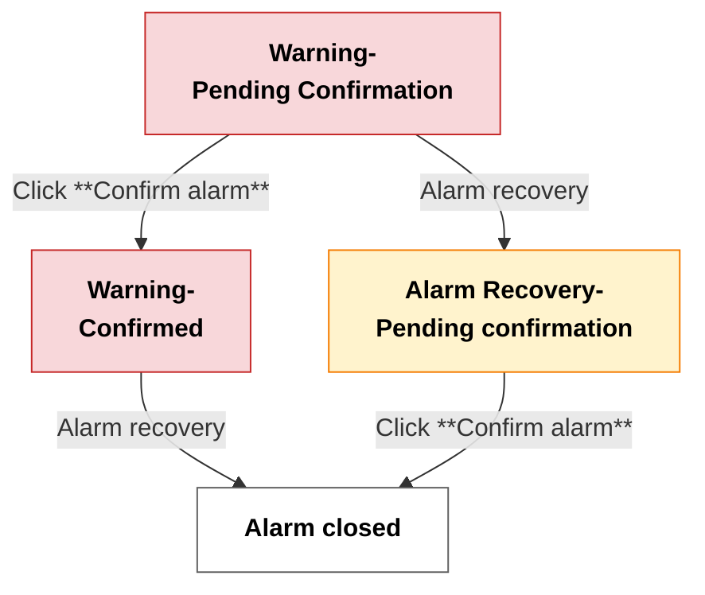

# Alarm Management

This guide will provide you with a comprehensive understanding of Aqara Studio’s alarm services, including configuration, viewing, and handling of alarms. Through uninterrupted real-time monitoring of all connected devices, the **Alarm Center** presents various alarm information collectively. It allows you to detect and address potential risks promptly and safeguard the security and stability of smart spaces.

## Overview

Aqara Studio offers complete alarm monitoring and management features. It comes with preset default alarm rules for monitoring protocol communication exceptions and device disconnections. Also, it supports user-defined alarm strategies. Therefore, users can detect risks and respond quickly in real time.

- **Multi-dimensional parameter binding**: Device properties (such as temperature, humidity) and business parameters (such as device operation mode) can be linked to trigger alarms dynamically.
- **Typical configuration examples**:
  - When the device temperature continuously exceeds 80°C for 5 minutes, a "High Temperature Alarm" is triggered.
  - When the instantaneous device power drops below 10W, a "Low Power Abnormal Alarm" is triggered.
  - When the device is in "Night Mode" and a motion signal is detected, a "Night Intrusion Alarm" is triggered.

In addition, the Alarm Center in Aqara Studio centrally presents the latest 10,000 alarms, covering critical information such as alarm events, types, sources, and states for unified viewing and management by users.

## Alarm Classes

Alarms can be divided into two classes: system default alarms and custom function point alarms:

| Dimension | System Default Alarm                | Custom Function Point Alarm                                                                |
| --------- | ----------------------------------- | ----------------------------------------------------------------------------------------- |
| Meaning   | Alarm for basic operational status of the device. | Alarms based on device function points (such as temperature, humidity, battery, etc.).    |
| Name      | Device Alarm Class                  | <ul><li>Normal</li><li>Urgent</li><li>Important</li><li>Other names customized by users</li></ul>   |
| Configured by | Aqara Studio                   | User                                                                                      |
| Configurability | Not modifiable                | Creatable, modifiable, deletable                                                          |
| Trigger Condition | Communication errors, and device offline | Device function point value meets user-defined alarm rule                                 |

:::tip
System default alarms are used to ensure the basic availability of the platform and devices; these rules are maintained by the system and cannot be modified or deleted by users.
:::

### Function Point Alarm Configuration

Alarm management includes configuring and customizing alarm rules for device function points, enabling real-time monitoring and timely response to abnormal states.

1. Go to the **Devices** page. In the device tree on the left, find the function point you want to view.
2. Select this point to view **Device details** tab.
3. Find the **Alarm config** section and click the **+** button.
4. In the popup, set the following parameters:

    | Parameter         | Description                                                                                      |
    |------------------|--------------------------------------------------------------------------------------------------|
    | Source Name      | The custom name of the alarm.                                                                    |
    | Alarm Value      | The value that triggers the alarm. For boolean function points, this is a single-choice parameter. For enum function points, you can select multiple values.  |
    | Alarm Class       | Alarm level. Options include Normal, Urgent, Important, or you can set a custom type.            |
    | Delay Time       | The system will only send an alarm to the user if the function point stays abnormal for this period. This helps to avoid false alarms caused by short fluctuations.  |
    | Normal Delay Time| After the function point leaves the alarm state, it must stay normal for this period to be considered recovered. This prevents frequent reminders due to temporary changes. |
    | To Off Normal Text | The message shown to the user when the alarm is triggered.                                        |
    | To Normal Text | The message shown to the user after recovery.                                                     |

    The diagram below illustrates the effect of delay time, normal delay time, user confirmation of alarms, and the status of alarm rule activation on the overall alarm timeline:

    

    For numeric function points, there are also these parameters:

    | Parameter         | Description                                                                 |
    |-------------------|-----------------------------------------------------------------------------|
    | Limit Enabled     | Choose to enable the lower limit, upper limit, or both.                      |
    | Low Limit       | The lowest allowed normal value. When the device reading drops below the low limit, the alarm state changes to abnormal (LOW_LIMIT).                                            |
    | High Limit      | The highest allowed normal value. When the device reading exceeds the high limit, the alarm state changes to abnormal (HIGH_LIMIT).                                           |
    | Deadband        | It is used to prevent frequent state switching due to small fluctuations near the threshold. <ul><li>When the low limit is enabled: Once the reading drops to the low limit and becomes abnormal, the state will only return to normal when the reading rises above the lower limit plus the deadband.</li><li>When the high limit is enabled: Once the reading rises to the high limit and becomes abnormal, the state will only return to normal when the reading drops below the high limit minus the deadband.</li></ul> |

    The diagram below shows how the alarm state responds as the device reading crosses the low and high limits, as well as when it returns to the recovery points (low limit + deadban, and high limit - deadband).

    

    After setting the parameters, click **Confirm**. You will see a new card in the **Alarm config** section.
5. Toggle the switch on the card to enable the alarm configuration.
6. After the alarm config is enabled, once the function point value meets the configured alarm rule, the alarm configuration card will automatically display the alarm prompt, status, occurrence time, and an acknowledge button. You can click the acknowledge button to quickly confirm the alarm.

## Alarm Lifecycle

In the **Alarm Config** section of the function point configuration page, you can view the current status of alarms in real time via the alarm config card and clearly track which stage of the alarm lifecycle it is in.

The alarm lifecycle is divided into four stages: "Warning-Pending Confirmation", "Warning-Confirmed", "Alarm Recovery-Pending confirmation", and "Alarm closed". Transitions between these stages depend both on whether the alarm has recovered to normal and on whether the user has confirmed it. The whole process is illustrated below:

Stage explanations:

- **Warning-Pending Confirmation**: A new alarm is generated, and the user has not yet confirmed it, indicating that the alarm requires attention and handling.
- **Warning-Confirmed**: The alarm still exists, but the user is aware of it, indicating that the alarm is being dealt with.
- **Alarm Recovery-Pending confirmation**: The alarm has recovered to normal, but the user has not confirmed it yet. This means the event will only be fully closed after user confirmation.
- **Alarm closed**: The alarm has recovered to normal and also been confirmed by the user. The alarm is now closed.

## Alarm Confirmation

The alarm confirmation process includes viewing and confirming alarms, described in detail as follows:

1. Click **Alarms** in the left navigation bar to display all alarms in a list.
2. Alarm information mainly includes the following fields:

   | Field             | Description                                                                                                           |
   | ----------------- | --------------------------------------------------------------------------------------------------------------------- |
   | Timestamp        | Specific time when the alarm occurred.                                                                                |
   | UUID        | Unique identifier of the alarm.                                                                                       |
   | Alarm Source      | Alarm source. Content varies depending on alarm type; for custom alarms, double-click to view specific device info.   |
   | Source State      | Current state of the alarm, including: <ul><li>NORMAL</li><li>OFF_NORMAL</li></ul>                                     |
   | Alarm Class    | Classification of the alarm, see [Alarm Classes](#alarm-classes).                                                         |
   | Alarm Data        | Detailed alarm data, varied by alarm type.                                                                            |
   | Priority          | Urgency level of the alarm.                                                                                           |
   | Normal Time     | Time when the alarm is cleared/recovered to normal.                                                                   |
   | Ack state | Whether the alarm is confirmed, including: <ul><li>UN_ACKED: The alarm is not confirmed.</li><li>ACKED: The alar is confirmed.</li><li>ACK-Pending: Aqara may take a long time to confirm, and once done, it switches to ACKED automatically.</li></ul> |
   | Ack Time | The time when the alarm was confirmed.                                                                          |
   | User     | User name of the person performing the confirmation.                                                 |
   | Last Updated | Most recent update time of the alarm information.                                                                     |

3. Double-click any alarm to open a detail popup showing full information of the alarm. For function point custom alarms, you can accurately locate which device and function point triggered this alarm in the popup.
4. At the bottom of the detail popup, click the **Confirm alarm** button, indicating the alarm has been acknowledged. Afterwards, the alarm’s ack state will change to `ACKED` or `ACK-Pending`.
5. As prompted by the alarm content, you may further investigate and handle protocol anomalies, device offline, etc. After resolving the root cause, the alarm state will switch from `OFF_NORMAL` to `NORMAL` automatically.

### Alarm Data Details

Different classes of alarm records contain different data fields. See the tables below:

#### System Default Alarm Fields

| Field Name   | Description                                          |
| ------------ | --------------------------------------------------- |
| sourceName   | Alarm source, usually device name or protocol name.  |
| msgText      | Description of the alarm event.                      |
| TimeZone     | Time zone information of the device.                 |

#### Function Point Custom Alarm Fields

| Field Name        | Description                                                                          |
| ----------------- | ------------------------------------------------------------------------------------ |
| offNormalValue    | (OFF_NORMAL only) The actual value of the abnormal property detected.                  |
| alarmValue        | (OFF_NORMAL only) Original threshold value of the alarm.                               |
| presentValue      | Real-time value of the current function point.                                             |
| fromState         | Status before the change.                                                   |
| toState           | Status after the change (current status).                                            |
| sourceName        | Alarm source; by default, the device function point name.                            |
| timeDelay         | Time delay (seconds) required to trigger the alarm.                                  |
| timeDelayToNormal | Time delay (seconds) to notify to alarm recovery.                                     |
| msgText           | Description of the alarm event.                                                      |
| count             | Number of occurrences of this alarm.                                                 |
| deadBand          | (Numeric only) Deadband threshold range.                                             |
| highLimit         | (Numeric only) Permitted upper value limit.                                          |
| lowLimit          | (Numeric only) Permitted lower value limit.                                          |
| numericValue      | (Boolean/Enum type) Numeric value corresponding to the boolean value or the enumeration.                        |
| TimeZone          | Time zone information of the device.                                                 |

:::tip
System default alarm data is usually concise, focusing on the source and content; function point custom alarms provide richer and more detailed attribute and status information as per configuration, helping users quickly locate and analyze the cause.
:::

## Alarms Page configuration

### Configure Visibility

To hide specific fields in the list, click the gear icon in Alarms. In the pop-up, uncheck the fields you do not wish to display.

### Filterr Data

To filter data in the Alarms page, click the "Filter" icon. In the pop-up, set filter criteria for list fields, and check those fields for which you want the filter to take effect:

| Field           | Configuration Description                                                                                                                                                                                   |
| --------------- | ------------------------------------------------------------------------------------------------------------------------------------------------------------------------------------------------------- |
| Timestamp | The time when the alarm occured. <ul><li>Start Time: Set the upper limit of the time range.</li><li>End Time: Set the lower limit of the time range.</li><li>Min Enabled(Enable Start Time): Whether to enable start time.</li><li>Max Enabled(Enable End Time): Whether to enable end time.</li></ul> |
| Uuid       | <ul><li>Include: Set multiple alarm IDs; only alarms with these IDs will be listed.</li><li>Exclude: Set multiple alarm IDs to exclude from the alarm list.</li></ul>                                            |
| Source State | Filter: Select required alarm states (multi-selection supported), and only alarms with these states will be shown.  |
| Alarm Source    | <ul><li>Include: Set multiple alarm sources; only alarms from these sources will be listed.</li><li>Exclude: Set multiple alarm sources to exclude from the alarm list.</li></ul>                           |
| Priority        | <ul><li>Min Value: Set minimum priority.</li><li>Max Value: Set maximum priority.</li><li>Min Enabled: Whether to enable min value.</li><li>Max Enabled: Whether to enable max value.</li></ul>   |
| Normal Time   | The time when the alarm recovered. Its configuration is the same as Timestamp. |
| Ack Time | The time when a user confirmed the alarm. Its configuration is the same as Timestamp.|                                     
| User  | <ul><li>Pattern: Supports entering the complete username, as well as the following fuzzy search syntax:<ul><li>%keyword%: Search for all usernames containing the keyword.</li><li>keyword%: Search for usernames starting with keyword.</li><li>%keyword: Search for usernames ending with keyword.</li></ul></li><li>Exact: Whether an exact match is required.</li><li>Include: Whether the list includes usernames containing the specified text or not.</li><li>Match Case: Whether case sensitivity is enabled.</li></ul> |
| Alarm Data      | Filter Entries: Filter alarms containing these data pairs via key-value pairs. Supports adding multiple key-value pairs.    |
| Last Update | The time when the alarm upates for the last time. Its configuration is the same as Timestamp.  |

## FAQ

### How to quickly locate the device that triggered a function point custom alarm?

When creating a function point custom alarm rule, if you use the system default function point name, the alarm source shown in the Alarm Center will often be something like `Switch - On/Off`, which does not intuitively indicate which device went wrong.

The way to find the specific device is as follows:
1. Double-click the alarm to pop up the detail window and find the "Alarm Source" path information in the window.
2. In the path, the `communication` node indicates the protocol, followed by the protocol used by the device (such as `Aqara`), and then the device name.

For example, if the alarm source path is:  
`local:|station:|property:/communication/Aqara/Wall Switch H1 (With Neutral, Single Rocker)/points/BinaryOutputObject/PROP_PRESENT_VALUE/alarm`

- The part after `communication` (here, `Aqara`) indicates this device uses the Aqara protocol.
- The part after `Aqara` (`Wall Switch H1 (With Neutral, Single Rocker)`) is the full device name, indicating exactly which device triggered the alarm.

Using the above method, you can quickly locate the specific device with an anomaly.